# 🔧 Guide d'Intégration Spark → OpenMetadata

*Les configurations concrètes à ajouter dans tes projets Spark existants*

## 🎯 Ce Guide pour Qui ?

```mermaid
flowchart LR
    Dev[👨‍💻 Dev Spark] --> Question{Tu as déjà un projet Spark ?}
    Question -->|✅ Oui| Integration[📋 Ce guide est pour toi !]
    Question -->|❌ Non| Demo[🐳 Use le docker-compose d'abord]
    
    Integration --> Add[➕ Ajouter quelques configs]
    Add --> Magic[✨ Lineage automatique !]
    
    Demo --> Learn[📚 Apprendre avec l'exemple]
    Learn --> Integration
```



**Tu es dans un de ces cas ?**
- ✅ Tu as déjà un cluster Spark (YARN, K8s, Standalone)
- ✅ Tu as des jobs ETL en production 
- ✅ Tu veux tracer le lineage sans refaire tes jobs
- ✅ Tu veux intégrer OpenMetadata dans ton infra existante

**Alors c'est parti !**

---

## 📦 Étape 1 : Récupérer les JARs (une fois pour toutes)

### 🔗 Téléchargement Automatique

```bash
#!/bin/bash
# setup-spark-lineage.sh - Script à lancer une fois

echo "🚀 Installation des JARs pour Spark + OpenMetadata"

# Dossier pour les JARs (ajuste selon ton env)
JARS_DIR="/opt/spark-lineage/jars"
mkdir -p $JARS_DIR
cd $JARS_DIR

echo "📦 Téléchargement OpenMetadata Spark Agent..."
wget -O openmetadata-spark-agent.jar \
  https://github.com/open-metadata/OpenMetadata/releases/download/1.9.7/openmetadata-spark-agent.jar

echo "📦 Téléchargement MySQL Connector..."
wget -O mysql-connector-j-8.0.33.jar \
  https://repo1.maven.org/maven2/mysql/mysql-connector-java/8.0.33/mysql-connector-java-8.0.33.jar

echo "📦 Téléchargement PostgreSQL Connector (optionnel)..."
wget -O postgresql-42.7.1.jar \
  https://repo1.maven.org/maven2/org/postgresql/postgresql/42.7.1/postgresql-42.7.1.jar

# Vérification
echo "✅ JARs téléchargés :"
ls -la *.jar

# Permissions
chmod 644 *.jar

echo "🎉 Setup terminé ! JARs dans : $JARS_DIR"
```

### 📋 URLs de Téléchargement Direct

| JAR | URL | Taille |
|-----|-----|--------|
| **OpenMetadata Agent** | `https://github.com/open-metadata/OpenMetadata/releases/download/1.9.7/openmetadata-spark-agent.jar` | ~50MB |
| **MySQL Connector** | `https://repo1.maven.org/maven2/mysql/mysql-connector-java/8.0.33/mysql-connector-java-8.0.33.jar` | ~2MB |
| **PostgreSQL Connector** | `https://repo1.maven.org/maven2/org/postgresql/postgresql/42.7.1/postgresql-42.7.1.jar` | ~1MB |

---

## 🔑 Étape 2 : Token JWT OpenMetadata

### 🚀 Méthode Rapide (via UI)

```mermaid
sequenceDiagram
    participant Toi as 👨‍💻 Toi
    participant Browser as 🌐 Navigateur  
    participant OM as 📊 OpenMetadata
    
    Toi->>Browser: http://openmetadata:8585
    Browser->>OM: Connexion (admin/admin)
    Toi->>OM: Settings → Bots
    OM->>Toi: Liste des bots disponibles
    Toi->>OM: Clique "ingestion-bot"
    OM->>Toi: Détails du bot
    Toi->>OM: "Generate New Token"
    OM->>Toi: 🎫 JWT Token généré !
    Note over Toi: Copie et sauvegarde le token
```



### 🤖 Méthode API (pour les scripts)

```bash
#!/bin/bash
# get-openmetadata-token.sh

OPENMETADATA_URL="http://your-openmetadata:8585"
ADMIN_USER="admin"  
ADMIN_PASS="admin"

echo "🔑 Génération du token JWT OpenMetadata..."

# Login et récupération du token
TOKEN_RESPONSE=$(curl -s -X POST "${OPENMETADATA_URL}/api/v1/users/login" \
  -H "Content-Type: application/json" \
  -d "{
    \"email\": \"${ADMIN_USER}\",
    \"password\": \"${ADMIN_PASS}\"
  }")

# Extraction du token d'accès
ACCESS_TOKEN=$(echo $TOKEN_RESPONSE | jq -r '.accessToken')

if [ "$ACCESS_TOKEN" != "null" ]; then
    echo "✅ Token obtenu avec succès !"
    echo "🔑 Token JWT : $ACCESS_TOKEN"
    
    # Sauvegarde dans un fichier
    echo "export OPENMETADATA_JWT_TOKEN='$ACCESS_TOKEN'" > openmetadata-token.env
    echo "💾 Token sauvé dans openmetadata-token.env"
    
    # Test du token
    curl -s -H "Authorization: Bearer $ACCESS_TOKEN" \
         "${OPENMETADATA_URL}/api/v1/system/version" > /dev/null
    
    if [ $? -eq 0 ]; then
        echo "✅ Token validé avec succès !"
    else
        echo "❌ Erreur de validation du token"
    fi
else
    echo "❌ Impossible d'obtenir le token"
    echo "Response: $TOKEN_RESPONSE"
fi
```

---

## ⚙️ Étape 3 : Configurations par Type d'Environnement

### 🏢 YARN Cluster (Production)

#### 📄 Méthode 1 : spark-defaults.conf Global

```properties
# /opt/spark/conf/spark-defaults.conf
# Configuration globale pour tous les jobs Spark

# === JARs OpenMetadata ===
spark.jars                              hdfs://namenode:9000/spark-lineage/openmetadata-spark-agent.jar,hdfs://namenode:9000/spark-lineage/mysql-connector-j-8.0.33.jar

# === Lineage Core ===
spark.extraListeners                    io.openlineage.spark.agent.OpenLineageSparkListener

# === OpenMetadata Transport ===
spark.openmetadata.transport.type       openMetadata
spark.openmetadata.transport.hostPort   http://openmetadata-prod.company.com:8585/api
spark.openmetadata.transport.pipelineServiceName production_spark_cluster

# === Options Performance ===
spark.openmetadata.transport.timeout    30
spark.openmetadata.transport.includeInputs   true
spark.openmetadata.transport.includeOutputs  true

# === Security (token via variable d'env) ===
# spark.openmetadata.transport.jwtToken sera défini via SPARK_CONF_DIR/spark-env.sh
```

#### 🔧 spark-env.sh (pour le token sécurisé)

```bash
# /opt/spark/conf/spark-env.sh
# Variables d'environnement sécurisées

# Token OpenMetadata (récupéré depuis un vault ou fichier sécurisé)
if [ -f "/etc/spark/secrets/openmetadata-token" ]; then
    OPENMETADATA_JWT_TOKEN=$(cat /etc/spark/secrets/openmetadata-token)
    export SPARK_CONF="$SPARK_CONF --conf spark.openmetadata.transport.jwtToken=$OPENMETADATA_JWT_TOKEN"
fi

# Autres configs sécurisées
export SPARK_LOCAL_DIRS="/tmp/spark"
export SPARK_WORKER_DIR="/var/log/spark"
```

#### 🚀 Lancement Job YARN

```bash
#!/bin/bash
# run-yarn-job-with-lineage.sh

# Variables spécifiques au job
JOB_NAME="customer_analytics_etl"
JOB_DATE=$(date +%Y%m%d_%H%M%S)
PIPELINE_NAME="${JOB_NAME}_${JOB_DATE}"

# Token (depuis un vault sécurisé en prod)
source /etc/spark/secrets/openmetadata.env

echo "🚀 Lancement job YARN avec lineage : $JOB_NAME"

spark-submit \
  --master yarn \
  --deploy-mode cluster \
  --name "$PIPELINE_NAME" \
  --driver-memory 4g \
  --driver-cores 2 \
  --executor-memory 8g \
  --executor-cores 3 \
  --num-executors 20 \
  --queue production \
  --conf "spark.openmetadata.transport.pipelineName=$PIPELINE_NAME" \
  --conf "spark.openmetadata.transport.pipelineDescription=ETL $JOB_NAME - $(date)" \
  --conf "spark.openmetadata.transport.jwtToken=$OPENMETADATA_JWT_TOKEN" \
  hdfs://namenode:9000/spark-jobs/${JOB_NAME}.py

echo "✅ Job lancé ! Pipeline: $PIPELINE_NAME"
echo "📊 Lineage disponible dans OpenMetadata"
```

### 🐳 Kubernetes (Cloud Native)

#### 📄 ConfigMap pour la Configuration

```yaml
# spark-lineage-configmap.yaml
apiVersion: v1
kind: ConfigMap
metadata:
  name: spark-lineage-config
  namespace: spark-jobs
data:
  spark-defaults.conf: |
    # Configuration Spark + OpenMetadata pour K8s
    spark.jars                              /opt/spark/jars/openmetadata-spark-agent.jar,/opt/spark/jars/mysql-connector-j-8.0.33.jar
    spark.extraListeners                    io.openlineage.spark.agent.OpenLineageSparkListener
    spark.openmetadata.transport.type       openMetadata
    spark.openmetadata.transport.hostPort   http://openmetadata-service.openmetadata.svc.cluster.local:8585/api
    spark.openmetadata.transport.pipelineServiceName k8s_spark_cluster
    spark.openmetadata.transport.timeout    30
    
  log4j.properties: |
    # Logs spécifiques OpenMetadata
    log4j.logger.io.openlineage=INFO
    log4j.logger.org.openmetadata=INFO
    log4j.rootLogger=WARN, console
    log4j.appender.console=org.apache.log4j.ConsoleAppender
    log4j.appender.console.layout=org.apache.log4j.PatternLayout
    log4j.appender.console.layout.ConversionPattern=%d{ISO8601} %p %c: %m%n
```

#### 🔑 Secret pour le Token

```yaml
# openmetadata-secret.yaml
apiVersion: v1
kind: Secret
metadata:
  name: openmetadata-secret
  namespace: spark-jobs
type: Opaque
data:
  # Token JWT encodé en base64 (echo -n "ton_token" | base64)
  jwt-token: ZXlKMGVYQWlPaUpLVjFRaUxDSmhiR2NpT2lKU1V6STFOaUo5...
```

#### 🚀 SparkApplication CRD

```yaml
# spark-etl-job.yaml
apiVersion: sparkoperator.k8s.io/v1beta2
kind: SparkApplication
metadata:
  name: customer-etl-with-lineage
  namespace: spark-jobs
spec:
  type: Python
  pythonVersion: "3"
  mode: cluster
  image: "bitnami/spark:3.5.0"
  imagePullPolicy: Always
  
  mainApplicationFile: "hdfs://namenode:9000/spark-jobs/customer_etl.py"
  
  sparkConf:
    "spark.openmetadata.transport.pipelineName": "k8s_customer_etl_$(date +%Y%m%d_%H%M%S)"
    "spark.openmetadata.transport.pipelineDescription": "Customer ETL Pipeline - Kubernetes"
    
  driver:
    cores: 2
    coreLimit: "2000m"
    memory: "4g"
    memoryOverhead: "1g"
    serviceAccount: spark-driver
    
    env:
    - name: OPENMETADATA_JWT_TOKEN
      valueFrom:
        secretKeyRef:
          name: openmetadata-secret
          key: jwt-token
    
    envVars:
      SPARK_CONF_DIR: "/opt/spark/conf"
    
    volumeMounts:
    - name: spark-config
      mountPath: /opt/spark/conf
      
  executor:
    cores: 3
    instances: 10
    memory: "8g"
    memoryOverhead: "2g"
    
    env:
    - name: OPENMETADATA_JWT_TOKEN
      valueFrom:
        secretKeyRef:
          name: openmetadata-secret
          key: jwt-token
    
    volumeMounts:
    - name: spark-config
      mountPath: /opt/spark/conf
      
  volumes:
  - name: spark-config
    configMap:
      name: spark-lineage-config
      
  restartPolicy:
    type: Never
```

#### 🔧 Déploiement K8s

```bash
#!/bin/bash
# deploy-k8s-spark-lineage.sh

echo "🚀 Déploiement Spark + OpenMetadata sur K8s"

# 1. Créer le namespace
kubectl create namespace spark-jobs

# 2. Appliquer les configurations
kubectl apply -f spark-lineage-configmap.yaml
kubectl apply -f openmetadata-secret.yaml

# 3. Lancer le job Spark
kubectl apply -f spark-etl-job.yaml

# 4. Suivre les logs
echo "📊 Suivi des logs :"
kubectl logs -f spark-customer-etl-with-lineage-driver -n spark-jobs

# 5. Vérifier le statut
kubectl get sparkapplications -n spark-jobs
```

### 🏠 Standalone Cluster (On-Premise)

#### 📄 Configuration Master/Workers

```bash
# /opt/spark/conf/spark-defaults.conf (sur master et workers)

# === JARs Distribution ===
spark.jars                              file:///opt/spark-lineage/jars/openmetadata-spark-agent.jar,file:///opt/spark-lineage/jars/mysql-connector-j-8.0.33.jar

# === Lineage ===
spark.extraListeners                    io.openlineage.spark.agent.OpenLineageSparkListener

# === OpenMetadata ===
spark.openmetadata.transport.type       openMetadata
spark.openmetadata.transport.hostPort   http://openmetadata.internal:8585/api
spark.openmetadata.transport.pipelineServiceName standalone_spark_cluster

# === Performance Standalone ===
spark.serializer                        org.apache.spark.serializer.KryoSerializer
spark.sql.adaptive.enabled              true
spark.sql.adaptive.coalescePartitions.enabled true
```

#### 🚀 Script de Lancement Standalone

```bash
#!/bin/bash
# run-standalone-job.sh

# Configuration environnement
export SPARK_HOME="/opt/spark"
export JAVA_HOME="/opt/jdk-11"
export SPARK_MASTER_URL="spark://spark-master.internal:7077"

# Informations job
JOB_NAME="$1"
JOB_FILE="$2"

if [ -z "$JOB_NAME" ] || [ -z "$JOB_FILE" ]; then
    echo "Usage: $0 <job_name> <job_file.py>"
    exit 1
fi

# Token OpenMetadata (depuis fichier sécurisé)
source /opt/spark-lineage/config/openmetadata.env

# Variables dynamiques
PIPELINE_NAME="${JOB_NAME}_$(date +%Y%m%d_%H%M%S)"
USER_NAME=$(whoami)

echo "🚀 Lancement job Standalone : $JOB_NAME"
echo "📊 Pipeline : $PIPELINE_NAME"
echo "🔗 Master : $SPARK_MASTER_URL"

$SPARK_HOME/bin/spark-submit \
  --master $SPARK_MASTER_URL \
  --total-executor-cores 16 \
  --executor-memory 6g \
  --driver-memory 2g \
  --conf "spark.openmetadata.transport.pipelineName=$PIPELINE_NAME" \
  --conf "spark.openmetadata.transport.pipelineDescription=Standalone job $JOB_NAME by $USER_NAME" \
  --conf "spark.openmetadata.transport.jwtToken=$OPENMETADATA_JWT_TOKEN" \
  $JOB_FILE

exit_code=$?

if [ $exit_code -eq 0 ]; then
    echo "✅ Job terminé avec succès !"
    echo "📊 Lineage disponible : http://openmetadata.internal:8585"
else
    echo "❌ Job échoué (code: $exit_code)"
fi

exit $exit_code
```

### 💻 Développement Local

#### 🔧 Configuration IDE (IntelliJ/VSCode)

```properties
# spark-local.conf (pour développement)
spark.master                            local[*]
spark.jars                              ./jars/openmetadata-spark-agent.jar,./jars/mysql-connector-j-8.0.33.jar
spark.extraListeners                    io.openlineage.spark.agent.OpenLineageSparkListener

# === Dev OpenMetadata ===
spark.openmetadata.transport.type       openMetadata
spark.openmetadata.transport.hostPort   http://localhost:8585/api
spark.openmetadata.transport.pipelineServiceName dev_spark
spark.openmetadata.transport.debugFacet true

# === Performance Local ===
spark.driver.memory                     2g
spark.executor.memory                   2g
spark.sql.shuffle.partitions            4
spark.default.parallelism               4
```

#### 🐍 Template de Développement Python

```python
#!/usr/bin/env python3
"""
Template de développement Spark avec lineage OpenMetadata
Usage: python dev-spark-job.py
"""

import os
import sys
from pyspark.sql import SparkSession
from pyspark.sql.functions import *

def create_dev_spark_session():
    """
    Session Spark pour développement avec lineage
    """
    
    # Configuration développement
    app_name = f"DEV-{os.path.basename(__file__)}"
    developer = os.getenv('USER', 'developer')
    
    # Token depuis variable d'env ou fichier local
    jwt_token = os.getenv('OPENMETADATA_JWT_TOKEN')
    if not jwt_token and os.path.exists('.openmetadata-token'):
        with open('.openmetadata-token', 'r') as f:
            jwt_token = f.read().strip()
    
    if not jwt_token:
        print("⚠️  OPENMETADATA_JWT_TOKEN non défini, lineage désactivé")
        return SparkSession.builder.appName(app_name).getOrCreate()
    
    # Chemins JARs (relatifs pour le dev)
    jars_path = "./jars"
    if not os.path.exists(jars_path):
        print("⚠️  Dossier ./jars non trouvé, lineage désactivé") 
        return SparkSession.builder.appName(app_name).getOrCreate()
    
    openmetadata_jar = f"{jars_path}/openmetadata-spark-agent.jar"
    mysql_jar = f"{jars_path}/mysql-connector-j-8.0.33.jar"
    
    print(f"🔧 Session Spark DEV : {app_name}")
    print(f"👨‍💻 Développeur : {developer}")
    print(f"📊 Lineage : Activé")
    
    return SparkSession.builder \
        .appName(app_name) \
        .master("local[*]") \
        .config("spark.jars", f"{openmetadata_jar},{mysql_jar}") \
        .config("spark.extraListeners", "io.openlineage.spark.agent.OpenLineageSparkListener") \
        .config("spark.openmetadata.transport.type", "openMetadata") \
        .config("spark.openmetadata.transport.hostPort", "http://localhost:8585/api") \
        .config("spark.openmetadata.transport.jwtToken", jwt_token) \
        .config("spark.openmetadata.transport.pipelineServiceName", "dev_spark") \
        .config("spark.openmetadata.transport.pipelineName", f"dev_{developer}_{app_name}") \
        .config("spark.openmetadata.transport.debugFacet", "true") \
        .getOrCreate()

def main():
    """Job de développement avec lineage"""
    
    spark = create_dev_spark_session()
    spark.sparkContext.setLogLevel("WARN")
    
    try:
        print("🚀 Début job de développement...")
        
        # === Ton code de test ici ===
        
        # Exemple : lecture CSV
        df = spark.read.option("header", "true").csv("./data/sample.csv")
        
        # Transformation simple
        df_processed = df.select("id", "name").filter(col("id").isNotNull())
        
        # Sauvegarde
        df_processed.write.mode("overwrite").parquet("./output/processed_data")
        
        print(f"✅ Job terminé ! {df_processed.count()} lignes traitées")
        print("📊 Check le lineage dans OpenMetadata : http://localhost:8585")
        
    except Exception as e:
        print(f"❌ Erreur : {e}")
        raise
    finally:
        spark.stop()

if __name__ == "__main__":
    main()
```

---

## 🎯 Étape 4 : Configuration OpenMetadata (Services)

### 🏢 Créer les Services de Données

```mermaid
sequenceDiagram
    participant Dev as 👨‍💻 Développeur
    participant OM as 📊 OpenMetadata UI
    participant Spark as ⚡ Spark Job
    
    Dev->>OM: 1. Créer Database Services
    Note over OM: MySQL Source, PostgreSQL, etc.
    
    Dev->>OM: 2. Créer Pipeline Service
    Note over OM: Spark Cluster Service
    
    Dev->>OM: 3. Tester connexions
    OM->>Dev: ✅ Services validés
    
    Dev->>Spark: 4. Lancer job avec lineage
    Spark->>OM: 5. Envoyer métadonnées
    OM->>Dev: 6. Lineage disponible !
```



#### 📊 Database Services (Sources et Destinations)

Dans OpenMetadata UI : **Settings** → **Services** → **Databases** → **Add Database Service**

**Pour MySQL :**
```json
{
  "name": "mysql_production_source",
  "serviceType": "MySQL",
  "connection": {
    "config": {
      "type": "Mysql",
      "scheme": "mysql+pymysql",
      "username": "spark_reader",
      "password": "***",
      "hostPort": "mysql-prod.company.com:3306",
      "database": "ecommerce"
    }
  }
}
```

**Pour PostgreSQL :**
```json
{
  "name": "postgresql_analytics_target", 
  "serviceType": "Postgres",
  "connection": {
    "config": {
      "type": "Postgres",
      "scheme": "postgresql+psycopg2",
      "username": "spark_writer",
      "password": "***",
      "hostPort": "postgres-analytics.company.com:5432",
      "database": "analytics"
    }
  }
}
```

#### ⚡ Pipeline Service (Spark Cluster)

**Settings** → **Services** → **Pipelines** → **Add Pipeline Service**

```json
{
  "name": "production_spark_cluster",
  "serviceType": "CustomPipeline", 
  "connection": {
    "config": {
      "type": "CustomPipeline",
      "sourcePythonClass": "metadata.ingestion.source.pipeline.pipeline_service.PipelineServiceSource"
    }
  }
}
```

### 🔧 Script d'Automatisation Services

```bash
#!/bin/bash
# setup-openmetadata-services.sh

OPENMETADATA_URL="http://openmetadata.company.com:8585"
JWT_TOKEN="$OPENMETADATA_JWT_TOKEN"

echo "🏢 Création des services OpenMetadata..."

# Function pour créer un service
create_service() {
    local service_name="$1"
    local service_config="$2"
    
    echo "📊 Création service : $service_name"
    
    curl -s -X POST "${OPENMETADATA_URL}/api/v1/services/databaseServices" \
      -H "Authorization: Bearer ${JWT_TOKEN}" \
      -H "Content-Type: application/json" \
      -d "$service_config"
}

# Service MySQL Production
mysql_config='{
  "name": "mysql_production",
  "serviceType": "MySQL",
  "connection": {
    "config": {
      "type": "Mysql",
      "scheme": "mysql+pymysql",
      "username": "'"$MYSQL_USER"'",
      "password": "'"$MYSQL_PASS"'",
      "hostPort": "'"$MYSQL_HOST"':3306",
      "database": "production"
    }
  }
}'

# Service Spark Cluster
spark_config='{
  "name": "production_spark_cluster",
  "serviceType": "CustomPipeline",
  "connection": {
    "config": {
      "type": "CustomPipeline"
    }
  }
}'

# Création des services
create_service "mysql_production" "$mysql_config"
create_service "spark_cluster" "$spark_config"

echo "✅ Services créés avec succès !"
```

---

## 🔍 Étape 5 : Test et Validation

### 🧪 Script de Test Complet

```bash
#!/bin/bash
# test-spark-lineage.sh - Validation complète de l'intégration

echo "🧪 Test d'intégration Spark + OpenMetadata"

# === Variables ===
SPARK_HOME="/opt/spark"
JARS_DIR="/opt/spark-lineage/jars"
OPENMETADATA_URL="http://openmetadata.company.com:8585"

# === Vérifications préalables ===
echo "🔍 Vérifications préalables..."

# 1. JARs présents
if [ ! -f "$JARS_DIR/openmetadata-spark-agent.jar" ]; then
    echo "❌ JAR OpenMetadata manquant"
    exit 1
fi
echo "✅ JAR OpenMetadata trouvé"

# 2. Spark disponible
if [ ! -f "$SPARK_HOME/bin/spark-submit" ]; then
    echo "❌ Spark non trouvé dans $SPARK_HOME"
    exit 1
fi
echo "✅ Spark trouvé"

# 3. OpenMetadata accessible
if ! curl -s "$OPENMETADATA_URL/api/v1/system/version" > /dev/null; then
    echo "❌ OpenMetadata non accessible"
    exit 1
fi
echo "✅ OpenMetadata accessible"

# 4. Token JWT valide
if [ -z "$OPENMETADATA_JWT_TOKEN" ]; then
    echo "❌ Token JWT non défini"
    exit 1
fi

if ! curl -s -H "Authorization: Bearer $OPENMETADATA_JWT_TOKEN" \
    "$OPENMETADATA_URL/api/v1/system/version" > /dev/null; then
    echo "❌ Token JWT invalide"
    exit 1
fi
echo "✅ Token JWT validé"

# === Job de test ===
echo "🚀 Lancement job de test..."

# Création d'un job Python simple
TEST_JOB="/tmp/test-lineage-job.py"
cat > $TEST_JOB << 'EOF'
from pyspark.sql import SparkSession
from pyspark.sql.functions import *

spark = SparkSession.builder.appName("LineageTest").getOrCreate()

# Données de test
data = [("Alice", 25), ("Bob", 30), ("Charlie", 35)]
df = spark.createDataFrame(data, ["name", "age"])

# Transformation simple
df_adults = df.filter(col("age") >= 18).withColumn("category", lit("adult"))

# Affichage (pas de destination pour ce test)
df_adults.show()

print("✅ Test lineage terminé avec succès !")
spark.stop()
EOF

# Lancement avec lineage
$SPARK_HOME/bin/spark-submit \
  --master local[2] \
  --jars "$JARS_DIR/openmetadata-spark-agent.jar" \
  --conf "spark.extraListeners=io.openlineage.spark.agent.OpenLineageSparkListener" \
  --conf "spark.openmetadata.transport.type=openMetadata" \
  --conf "spark.openmetadata.transport.hostPort=$OPENMETADATA_URL/api" \
  --conf "spark.openmetadata.transport.jwtToken=$OPENMETADATA_JWT_TOKEN" \
  --conf "spark.openmetadata.transport.pipelineServiceName=test_spark_service" \
  --conf "spark.openmetadata.transport.pipelineName=lineage_integration_test" \
  $TEST_JOB

# Vérification dans OpenMetadata
echo "🔍 Vérification du lineage dans OpenMetadata..."
sleep 5

# Check si le pipeline existe
PIPELINE_CHECK=$(curl -s -H "Authorization: Bearer $OPENMETADATA_JWT_TOKEN" \
  "$OPENMETADATA_URL/api/v1/services/pipelineServices/test_spark_service/pipelines" | \
  jq -r '.data[] | select(.name=="lineage_integration_test") | .name')

if [ "$PIPELINE_CHECK" = "lineage_integration_test" ]; then
    echo "✅ Pipeline créé dans OpenMetadata !"
    echo "📊 Lineage visible sur : $OPENMETADATA_URL"
else
    echo "⚠️  Pipeline pas encore visible (peut prendre quelques minutes)"
fi

# Nettoyage
rm -f $TEST_JOB

echo "🎉 Test d'intégration terminé !"
```

### 📊 Validation du Lineage

```python
#!/usr/bin/env python3
"""
validate-lineage.py - Vérification du lineage via API OpenMetadata
"""

import requests
import json
import os
import sys

class OpenMetadataValidator:
    def __init__(self, base_url, jwt_token):
        self.base_url = base_url.rstrip('/')
        self.headers = {
            'Authorization': f'Bearer {jwt_token}',
            'Content-Type': 'application/json'
        }
    
    def check_pipeline_service(self, service_name):
        """Vérifier qu'un service pipeline existe"""
        url = f"{self.base_url}/api/v1/services/pipelineServices/{service_name}"
        response = requests.get(url, headers=self.headers)
        return response.status_code == 200
    
    def get_pipelines(self, service_name):
        """Récupérer les pipelines d'un service"""
        url = f"{self.base_url}/api/v1/services/pipelineServices/{service_name}/pipelines"
        response = requests.get(url, headers=self.headers)
        if response.status_code == 200:
            return response.json().get('data', [])
        return []
    
    def get_pipeline_lineage(self, pipeline_fqn):
        """Récupérer le lineage d'un pipeline"""
        url = f"{self.base_url}/api/v1/lineage/table/{pipeline_fqn}"
        response = requests.get(url, headers=self.headers)
        if response.status_code == 200:
            return response.json()
        return None
    
    def validate_integration(self, service_name, pipeline_name=None):
        """Validation complète de l'intégration"""
        print(f"🔍 Validation service : {service_name}")
        
        # 1. Vérifier le service
        if not self.check_pipeline_service(service_name):
            print(f"❌ Service {service_name} introuvable")
            return False
        print(f"✅ Service {service_name} trouvé")
        
        # 2. Lister les pipelines
        pipelines = self.get_pipelines(service_name)
        print(f"📊 {len(pipelines)} pipeline(s) trouvé(s)")
        
        if not pipelines:
            print("⚠️  Aucun pipeline avec lineage détecté")
            return True  # Service OK mais pas de pipeline encore
        
        # 3. Vérifier lineage des pipelines
        for pipeline in pipelines:
            name = pipeline.get('name')
            fqn = pipeline.get('fullyQualifiedName')
            
            if pipeline_name and name != pipeline_name:
                continue
                
            print(f"🔗 Vérification lineage : {name}")
            
            lineage = self.get_pipeline_lineage(fqn)
            if lineage:
                nodes = lineage.get('nodes', [])
                edges = lineage.get('downstreamEdges', [])
                print(f"  📊 {len(nodes)} entités, {len(edges)} relations")
            else:
                print(f"  ⚠️  Pas de lineage pour {name}")
        
        return True

def main():
    # Configuration
    openmetadata_url = os.getenv('OPENMETADATA_URL', 'http://localhost:8585')
    jwt_token = os.getenv('OPENMETADATA_JWT_TOKEN')
    
    if not jwt_token:
        print("❌ OPENMETADATA_JWT_TOKEN requis")
        sys.exit(1)
    
    # Services à vérifier
    services_to_check = [
        'production_spark_cluster',
        'dev_spark',
        'k8s_spark_cluster',
        'test_spark_service'
    ]
    
    validator = OpenMetadataValidator(openmetadata_url, jwt_token)
    
    print("🧪 Validation de l'intégration Spark + OpenMetadata")
    print(f"🔗 URL : {openmetadata_url}")
    
    all_good = True
    for service in services_to_check:
        if not validator.validate_integration(service):
            all_good = False
        print()
    
    if all_good:
        print("✅ Intégration validée avec succès !")
    else:
        print("❌ Problèmes détectés dans l'intégration")
        sys.exit(1)

if __name__ == "__main__":
    main()
```

---

## 🎯 Récapitulatif des Configurations à Ajouter

### 📋 Checklist d'Intégration

| Étape | Configuration | Statut |
|-------|---------------|--------|
| **1. JARs** | ✅ openmetadata-spark-agent.jar | ⬜ |
| | ✅ mysql-connector-j-8.0.33.jar | ⬜ |
| **2. Token** | ✅ JWT Token OpenMetadata | ⬜ |
| **3. Spark Config** | ✅ spark.extraListeners | ⬜ |
| | ✅ spark.openmetadata.transport.* | ⬜ |
| **4. Services OM** | ✅ Database Services (sources) | ⬜ |
| | ✅ Pipeline Service (Spark) | ⬜ |
| **5. Test** | ✅ Job de test avec lineage | ⬜ |

### 🚀 Configuration Minimale (pour commencer)

```bash
# La config minimale pour voir le lineage
spark-submit \
  --jars /path/to/openmetadata-spark-agent.jar \
  --conf "spark.extraListeners=io.openlineage.spark.agent.OpenLineageSparkListener" \
  --conf "spark.openmetadata.transport.type=openMetadata" \
  --conf "spark.openmetadata.transport.hostPort=http://your-openmetadata:8585/api" \
  --conf "spark.openmetadata.transport.jwtToken=YOUR_JWT_TOKEN" \
  --conf "spark.openmetadata.transport.pipelineServiceName=your_service" \
  ton_job.py
```

### 🏆 Configuration Complète (pour la prod)

```properties
# spark-defaults.conf complet
spark.jars                              /opt/spark-lineage/jars/openmetadata-spark-agent.jar
spark.extraListeners                    io.openlineage.spark.agent.OpenLineageSparkListener
spark.openmetadata.transport.type       openMetadata
spark.openmetadata.transport.hostPort   http://openmetadata.company.com:8585/api
spark.openmetadata.transport.pipelineServiceName production_spark_cluster
spark.openmetadata.transport.timeout    30
spark.openmetadata.transport.includeInputs   true
spark.openmetadata.transport.includeOutputs  true
spark.openmetadata.transport.debugFacet false
```

---

## 🎉 Et Voilà !

Une fois ces configurations ajoutées, tous tes jobs Spark existants vont automatiquement envoyer leur lineage vers OpenMetadata. **Zéro modification de code nécessaire !**

**Ce que tu vas voir dans OpenMetadata :**
- 🔗 **Graphiques de lineage** interactifs
- 📊 **Métadonnées enrichies** (schémas, colonnes, types)
- ⏱️ **Historique des exécutions** avec timestamps
- 🏷️ **Tags automatiques** (Spark, Pipeline names, etc.)
- 👁️ **Traçabilité colonne par colonne**

**Questions ?** Check la section troubleshooting du README principal !

*Made with ❤️ pour les équipes qui veulent du lineage sans se prendre la tête*