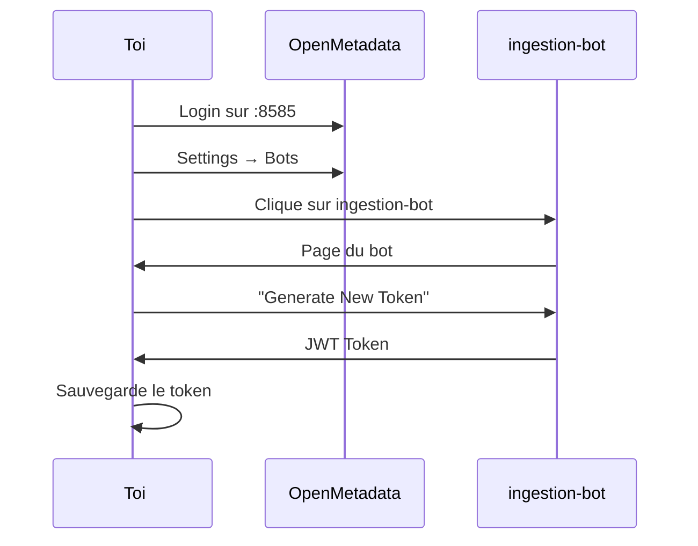
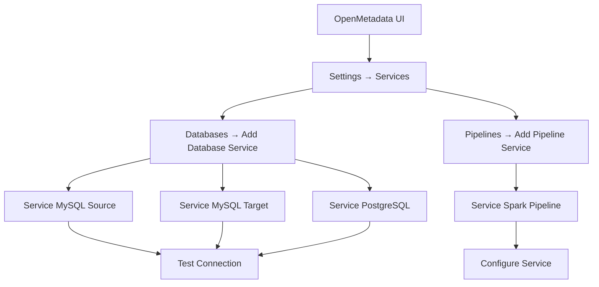
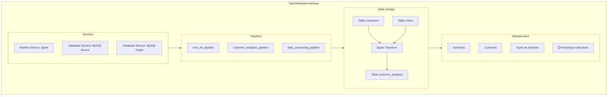

# Spark ↔ OpenMetadata Lineage Connector

Welcome to the Spark ↔ OpenMetadata Lineage connector! This project provides a professional, enterprise-grade solution for automated data lineage tracking in Apache Spark, with direct exposure in OpenMetadata.

---

##  Documentation

- **[Full Technical Documentation (multi-language)](./full_documentation.md)**
- [Français](./README-fr.md) | [Español](./README-es.md) | [العربية](./README-ar.md)

---

##  Quick Start

1. **Clone the repository**
   ```powershell
   git clone <repository-url>
   cd spark
   ```
2. **Download required JARs**
   ```powershell
   # Download OpenMetadata Spark Agent and MySQL connector
   # (see full_documentation.md for links)
   ```
3. **Set up your Spark environment**
   - Add JARs to your Spark classpath (via `spark-submit` or `spark-defaults.conf`).
   - Configure OpenMetadata endpoint and JWT token.
4. **Run example job**
   ```powershell
   ./run-example.sh
   ```
5. **Verify lineage in OpenMetadata**
   - Access OpenMetadata UI at `http://localhost:8585` and check Pipelines/Data Lineage.

For advanced configuration, troubleshooting, and architecture details, see [full_documentation.md](./full_documentation.md).

---

## ️ Project Structure

- `full_documentation.md` — Complete technical guide (EN, FR, ES, AR)
- `README-fr.md`, `README-es.md`, `README-ar.md` — Language-specific quickstart and links
- `docker-compose.yml` — Infrastructure services
- `samples/` — SQL initialization examples
- `jars/` — Required JAR files
- `complex_spark_lineage_job.py` — Example Spark ETL job
- `docs/` — Additional documentation

---

##  Contributing & Support

We welcome contributions in all languages! For details, see the [contribution guidelines](./full_documentation.md#-contributing--contribution--contribución--المساهمة).

For support, open a GitHub issue or see the [Support section](./full_documentation.md#-support--assistance--soporte--الدعم).

---

**Built with ️ for the global data community**
## Option A : Déploiement Docker

### Installation rapide

```bash
# 1. Clone le projet
git clone https://github.com/Monsau/sparklineage.git
cd sparklineage

# 2. Lance tout l'environnement
docker-compose up -d

# 3. Attends que tout démarre (30 sec environ)
docker-compose ps

# 4. Lance le job d'exemple
./run-example.sh
```

#### Lancement manuel
```bash
docker exec spark-master /opt/bitnami/spark/bin/spark-submit \
  --master spark://spark-master:7077 \
  --jars /opt/bitnami/spark/jars/openmetadata-spark-agent.jar,/opt/bitnami/spark/jars/mysql-connector-j-8.0.33.jar \
  --conf "spark.extraListeners=io.openlineage.spark.agent.OpenLineageSparkListener" \
  --conf "spark.openmetadata.transport.type=openMetadata" \
  --conf "spark.openmetadata.transport.hostPort=http://openmetadata:8585/api" \
  --conf "spark.openmetadata.transport.jwtToken=YOUR_TOKEN" \
  /opt/bitnami/spark/complex_spark_lineage_job.py
```

###  Services Disponibles

| Service | URL | Credentials |
|---------|-----|-------------|
|  **OpenMetadata UI** | http://localhost:8585 | admin/admin |
|  **Spark Master** | http://localhost:8080 | - |
| ️ **MySQL Source** | localhost:3308 | root/password |
| ️ **MySQL Target** | localhost:3307 | root/password |

---


## Option B : Intégration dans un cluster Spark existant

### Étape 1 : Récupération des JARs

```bash
# Crée un dossier pour les JARs
mkdir -p /opt/spark-lineage/jars
cd /opt/spark-lineage/jars

# Download des JARs nécessaires
wget https://github.com/open-metadata/OpenMetadata/releases/download/1.9.7/openmetadata-spark-agent.jar
wget https://repo1.maven.org/maven2/mysql/mysql-connector-java/8.0.33/mysql-connector-java-8.0.33.jar

# Vérification
ls -la *.jar
```


### Étape 2 : Récupération du token OpenMetadata



1. Accéder à OpenMetadata : `http://<openmetadata-host>:8585`
2. Aller dans Settings → Bots
3. Sélectionner ou créer le bot d'ingestion
4. Générer un nouveau token et le conserver dans un gestionnaire sécurisé


### Étape 3 : Configuration Spark


#### Méthode 1 : spark-submit (exécution ponctuelle)

```bash
spark-submit \
  --master yarn \  # ou spark://master:7077, ou local[*]
  --deploy-mode cluster \
  --jars /opt/spark-lineage/jars/openmetadata-spark-agent.jar,/opt/spark-lineage/jars/mysql-connector-j-8.0.33.jar \
  --conf "spark.extraListeners=io.openlineage.spark.agent.OpenLineageSparkListener" \
  --conf "spark.openmetadata.transport.type=openMetadata" \
  --conf "spark.openmetadata.transport.hostPort=http://ton-openmetadata:8585/api" \
  --conf "spark.openmetadata.transport.jwtToken=TON_JWT_TOKEN" \
  --conf "spark.openmetadata.transport.pipelineServiceName=ton_service_pipeline" \
  --conf "spark.openmetadata.transport.pipelineName=ton_job_etl" \
  ton_job.py
```


#### Méthode 2 : spark-defaults.conf (configuration globale)

```properties
# /opt/spark/conf/spark-defaults.conf
spark.jars                              /opt/spark-lineage/jars/openmetadata-spark-agent.jar,/opt/spark-lineage/jars/mysql-connector-j-8.0.33.jar
spark.extraListeners                    io.openlineage.spark.agent.OpenLineageSparkListener
spark.openmetadata.transport.type       openMetadata
spark.openmetadata.transport.hostPort   http://ton-openmetadata:8585/api
spark.openmetadata.transport.jwtToken   TON_JWT_TOKEN
spark.openmetadata.transport.pipelineServiceName ton_service_pipeline
```

#### Méthode 3 : Configuration dans le code (Python/Scala)

**Python :**
```python
from pyspark.sql import SparkSession

# Configuration avec lineage
spark = SparkSession.builder \
    .appName("MonJobAvecLineage") \
    .config("spark.jars", "/opt/spark-lineage/jars/openmetadata-spark-agent.jar,/opt/spark-lineage/jars/mysql-connector-j-8.0.33.jar") \
    .config("spark.extraListeners", "io.openlineage.spark.agent.OpenLineageSparkListener") \
    .config("spark.openmetadata.transport.type", "openMetadata") \
    .config("spark.openmetadata.transport.hostPort", "http://ton-openmetadata:8585/api") \
    .config("spark.openmetadata.transport.jwtToken", "TON_JWT_TOKEN") \
    .config("spark.openmetadata.transport.pipelineServiceName", "mon_service") \
    .config("spark.openmetadata.transport.pipelineName", "mon_pipeline_etl") \
    .getOrCreate()

df_source = spark.read.jdbc("jdbc:mysql://source/db", "ma_table", properties=props)
df_clean = df_source.filter("status = 'active'").select("id", "name", "value")
df_clean.write.jdbc("jdbc:mysql://target/db", "ma_table_clean", mode="overwrite", properties=props)

spark.stop()

# Code ETL standard, le lineage est capturé automatiquement
...existing code...
```

**Scala :**
```scala
import org.apache.spark.sql.SparkSession

val spark = SparkSession.builder()
  .appName("MonJobAvecLineage")
  .config("spark.jars", "/opt/spark-lineage/jars/openmetadata-spark-agent.jar,/opt/spark-lineage/jars/mysql-connector-j-8.0.33.jar")
  .config("spark.extraListeners", "io.openlineage.spark.agent.OpenLineageSparkListener")
  .config("spark.openmetadata.transport.type", "openMetadata")
  .config("spark.openmetadata.transport.hostPort", "http://ton-openmetadata:8585/api")
  .config("spark.openmetadata.transport.jwtToken", "TON_JWT_TOKEN")
  .config("spark.openmetadata.transport.pipelineServiceName", "mon_service")
  .getOrCreate()

// Ton ETL habituel
val dfSource = spark.read.jdbc("jdbc:mysql://source/db", "ma_table", props)
val dfClean = dfSource.filter($"status" === "active").select("id", "name", "value")
dfClean.write.jdbc("jdbc:mysql://target/db", "ma_table_clean", SaveMode.Overwrite, props)
```


#### Méthode 4 : Variables d'environnement

```bash
# Variables pour simplifier
export SPARK_HOME=/opt/spark
export OPENMETADATA_HOST=http://ton-openmetadata:8585/api
export OPENMETADATA_JWT_TOKEN=ton_jwt_token
export PIPELINE_SERVICE_NAME=mon_service_pipeline

# Script de lancement simplifié
#!/bin/bash
$SPARK_HOME/bin/spark-submit \
  --jars /opt/spark-lineage/jars/openmetadata-spark-agent.jar,/opt/spark-lineage/jars/mysql-connector-j-8.0.33.jar \
  --conf "spark.extraListeners=io.openlineage.spark.agent.OpenLineageSparkListener" \
  --conf "spark.openmetadata.transport.type=openMetadata" \
  --conf "spark.openmetadata.transport.hostPort=$OPENMETADATA_HOST" \
  --conf "spark.openmetadata.transport.jwtToken=$OPENMETADATA_JWT_TOKEN" \
  --conf "spark.openmetadata.transport.pipelineServiceName=$PIPELINE_SERVICE_NAME" \
  $1  # Ton script Spark
```


### Étape 4 : Configuration des services OpenMetadata



1. Créer les services de bases de données dans OpenMetadata (Settings → Services → Databases)
2. Ajouter le service pipeline (Settings → Services → Pipelines), nom cohérent avec la configuration Spark

---


## Configuration avancée

###  Options de Configuration Complètes

```bash
# Configuration complète pour spark-submit
spark-submit \
  --master yarn \
  --deploy-mode cluster \
  --jars /path/to/openmetadata-spark-agent.jar,/path/to/mysql-connector.jar \
  \
  # === OpenMetadata Core === 
  --conf "spark.extraListeners=io.openlineage.spark.agent.OpenLineageSparkListener" \
  --conf "spark.openmetadata.transport.type=openMetadata" \
  --conf "spark.openmetadata.transport.hostPort=http://openmetadata:8585/api" \
  --conf "spark.openmetadata.transport.jwtToken=YOUR_JWT_TOKEN" \
  \
  # === Services & Pipeline ===
  --conf "spark.openmetadata.transport.pipelineServiceName=spark_pipeline_service" \
  --conf "spark.openmetadata.transport.pipelineName=mon_etl_pipeline" \
  --conf "spark.openmetadata.transport.pipelineDescription=Pipeline ETL automatique" \
  \
  # === Options Avancées ===
  --conf "spark.openmetadata.transport.timeout=30" \
  --conf "spark.openmetadata.transport.includeInputs=true" \
  --conf "spark.openmetadata.transport.includeOutputs=true" \
  --conf "spark.openmetadata.transport.facetsDisabled=" \
  \
  # === Debug & Monitoring ===
  --conf "spark.openmetadata.transport.debugFacet=false" \
  --conf "spark.openmetadata.transport.metricsEnabled=true" \
  \
  ton_script.py
```

###  Variables d'Environnement Détaillées

```bash
# === Core OpenMetadata ===
export OPENMETADATA_HOST="http://ton-openmetadata:8585/api"
export OPENMETADATA_JWT_TOKEN="ton_super_token_jwt"

# === Services ===
export PIPELINE_SERVICE_NAME="spark_pipeline_service"
export DATABASE_SERVICE_SOURCE="mysql_source_service"  
export DATABASE_SERVICE_TARGET="mysql_target_service"

# === Pipeline Info ===
export PIPELINE_NAME="etl_${USER}_$(date +%Y%m%d)"
export PIPELINE_DESCRIPTION="Pipeline ETL automatique - $(date)"

# === Chemins ===
export SPARK_JARS_PATH="/opt/spark-lineage/jars"
export OPENMETADATA_JAR="$SPARK_JARS_PATH/openmetadata-spark-agent.jar"
export MYSQL_JAR="$SPARK_JARS_PATH/mysql-connector-j-8.0.33.jar"

# === Options ===
export LINEAGE_TIMEOUT=30
export LINEAGE_DEBUG=false
```


### Exemple de job Python complet

```python
#!/usr/bin/env python3
"""
Job Spark ETL avec Lineage OpenMetadata automatique
"""

import os
from pyspark.sql import SparkSession
from pyspark.sql.functions import *

def create_spark_session():
    """Crée une session Spark avec lineage OpenMetadata"""
    
    # Configuration depuis les variables d'environnement
    openmetadata_host = os.getenv('OPENMETADATA_HOST', 'http://localhost:8585/api')
    jwt_token = os.getenv('OPENMETADATA_JWT_TOKEN')
    pipeline_service = os.getenv('PIPELINE_SERVICE_NAME', 'spark_pipeline_service')
    pipeline_name = os.getenv('PIPELINE_NAME', f'etl_job_{os.getenv("USER", "spark")}')
    
    # Vérification du token
    if not jwt_token:
        raise ValueError("OPENMETADATA_JWT_TOKEN non défini !")
    
    # Chemins des JARs
    jars_path = os.getenv('SPARK_JARS_PATH', '/opt/spark-lineage/jars')
    openmetadata_jar = f"{jars_path}/openmetadata-spark-agent.jar"
    mysql_jar = f"{jars_path}/mysql-connector-j-8.0.33.jar"
    
    print(f" Création session Spark avec lineage vers {openmetadata_host}")
    print(f" Pipeline Service: {pipeline_service}")
    print(f" Pipeline Name: {pipeline_name}")
    
    return SparkSession.builder \
        .appName(f"ETL-{pipeline_name}") \
        .config("spark.jars", f"{openmetadata_jar},{mysql_jar}") \
        .config("spark.extraListeners", "io.openlineage.spark.agent.OpenLineageSparkListener") \
        .config("spark.openmetadata.transport.type", "openMetadata") \
        .config("spark.openmetadata.transport.hostPort", openmetadata_host) \
        .config("spark.openmetadata.transport.jwtToken", jwt_token) \
        .config("spark.openmetadata.transport.pipelineServiceName", pipeline_service) \
        .config("spark.openmetadata.transport.pipelineName", pipeline_name) \
        .config("spark.openmetadata.transport.timeout", "30") \
        .config("spark.openmetadata.transport.includeInputs", "true") \
        .config("spark.openmetadata.transport.includeOutputs", "true") \
        .getOrCreate()

def main():
    """Job ETL principal avec lineage automatique"""
    
    # Initialisation
    spark = create_spark_session()
    spark.sparkContext.setLogLevel("WARN")
    
    print(" Début du job ETL avec lineage automatique...")
    
    try:
        # === Lecture des sources (lineage automatiquement capturé) ===
        print(" Lecture des données sources...")
        
        # Source MySQL
        df_customers = spark.read \
            .format("jdbc") \
            .option("url", "jdbc:mysql://mysql-source:3306/ecommerce") \
            .option("dbtable", "customers") \
            .option("user", "root") \
            .option("password", "password") \
            .load()
        
        df_orders = spark.read \
            .format("jdbc") \
            .option("url", "jdbc:mysql://mysql-source:3306/ecommerce") \
            .option("dbtable", "orders") \
            .option("user", "root") \
            .option("password", "password") \
            .load()
        
        # === Transformations (lineage des colonnes tracé) ===
        print(" Transformations des données...")
        
        # Nettoyage et enrichissement
        df_customers_clean = df_customers \
            .filter(col("status") == "active") \
            .withColumn("full_name", concat(col("first_name"), lit(" "), col("last_name"))) \
            .select("customer_id", "full_name", "email", "country", "created_at")
        
        # Jointure et agrégation
        df_customer_stats = df_orders \
            .join(df_customers_clean, "customer_id") \
            .groupBy("customer_id", "full_name", "country") \
            .agg(
                count("order_id").alias("total_orders"),
                sum("amount").alias("total_spent"),
                max("order_date").alias("last_order_date")
            )
        
        # Calcul de segments client
        df_final = df_customer_stats \
            .withColumn("customer_segment", 
                when(col("total_spent") > 1000, "Premium")
                .when(col("total_spent") > 500, "Gold") 
                .otherwise("Standard")
            ) \
            .withColumn("processed_at", current_timestamp())
        
        # === Écriture (lineage automatiquement capturé) ===
        print(" Sauvegarde des résultats...")
        
        # Vers MySQL Target
        df_final.write \
            .format("jdbc") \
            .option("url", "jdbc:mysql://mysql-target:3306/analytics") \
            .option("dbtable", "customer_analytics") \
            .option("user", "root") \
            .option("password", "password") \
            .mode("overwrite") \
            .save()
        
        print(f" Job terminé ! {df_final.count()} lignes traitées")
        print(" Lineage disponible dans OpenMetadata !")
        
    except Exception as e:
        print(f" Erreur dans le job : {str(e)}")
        raise
    finally:
        spark.stop()
        print(" Session Spark fermée")

if __name__ == "__main__":
    main()
```

###  Script de Lancement Automatisé

```bash
#!/bin/bash
# run-spark-with-lineage.sh

set -e

# === Configuration ===
SCRIPT_NAME=$(basename "$1")
JOB_DATE=$(date +%Y%m%d_%H%M%S)

echo " Lancement job Spark avec lineage : $SCRIPT_NAME"
echo " Date/Heure : $JOB_DATE"

# Vérifications préalables
if [ -z "$OPENMETADATA_JWT_TOKEN" ]; then
    echo " OPENMETADATA_JWT_TOKEN non défini"
    exit 1
fi

if [ ! -f "$1" ]; then
    echo " Script Spark non trouvé : $1"
    exit 1
fi

# Export variables pour le job
export PIPELINE_NAME="etl_${USER}_${JOB_DATE}"
export PIPELINE_DESCRIPTION="Job ETL automatique - $SCRIPT_NAME - $JOB_DATE"

echo " Pipeline : $PIPELINE_NAME"
echo " OpenMetadata : $OPENMETADATA_HOST"

# Lancement avec lineage
$SPARK_HOME/bin/spark-submit \
  --master ${SPARK_MASTER:-yarn} \
  --deploy-mode ${SPARK_DEPLOY_MODE:-client} \
  --jars ${OPENMETADATA_JAR},${MYSQL_JAR} \
  --conf "spark.extraListeners=io.openlineage.spark.agent.OpenLineageSparkListener" \
  --conf "spark.openmetadata.transport.type=openMetadata" \
  --conf "spark.openmetadata.transport.hostPort=$OPENMETADATA_HOST" \
  --conf "spark.openmetadata.transport.jwtToken=$OPENMETADATA_JWT_TOKEN" \
  --conf "spark.openmetadata.transport.pipelineServiceName=$PIPELINE_SERVICE_NAME" \
  --conf "spark.openmetadata.transport.pipelineName=$PIPELINE_NAME" \
  --conf "spark.openmetadata.transport.pipelineDescription=$PIPELINE_DESCRIPTION" \
  "$@"

echo " Job terminé ! Lineage disponible dans OpenMetadata"
```

**Utilisation :**
```bash
# Rendre le script exécutable
chmod +x run-spark-with-lineage.sh

# Lancer ton job avec lineage
./run-spark-with-lineage.sh mon_job_etl.py

# Ou avec des options Spark supplémentaires
./run-spark-with-lineage.sh mon_job_etl.py --conf "spark.executor.memory=4g"
```

---


## Exemples de configurations prêtes à l'emploi

###  Pour YARN Cluster

```bash
# Production YARN avec lineage
spark-submit \
  --master yarn \
  --deploy-mode cluster \
  --driver-memory 2g \
  --executor-memory 4g \
  --executor-cores 2 \
  --num-executors 10 \
  --jars hdfs://namenode:9000/spark-lineage/openmetadata-spark-agent.jar,hdfs://namenode:9000/spark-lineage/mysql-connector-j-8.0.33.jar \
  --conf "spark.extraListeners=io.openlineage.spark.agent.OpenLineageSparkListener" \
  --conf "spark.openmetadata.transport.type=openMetadata" \
  --conf "spark.openmetadata.transport.hostPort=http://openmetadata-prod:8585/api" \
  --conf "spark.openmetadata.transport.jwtToken=$OPENMETADATA_JWT_TOKEN" \
  --conf "spark.openmetadata.transport.pipelineServiceName=production_spark_service" \
  hdfs://namenode:9000/spark-jobs/production_etl.py
```

###  Pour Kubernetes

```yaml
# spark-lineage-k8s.yaml
apiVersion: v1
kind: ConfigMap
metadata:
  name: spark-lineage-config
data:
  spark-defaults.conf: |
    spark.jars                              /opt/spark/jars/openmetadata-spark-agent.jar,/opt/spark/jars/mysql-connector-j-8.0.33.jar
    spark.extraListeners                    io.openlineage.spark.agent.OpenLineageSparkListener
    spark.openmetadata.transport.type       openMetadata
    spark.openmetadata.transport.hostPort   http://openmetadata-service:8585/api
    spark.openmetadata.transport.pipelineServiceName k8s_spark_service
---
apiVersion: batch/v1
kind: Job
metadata:
  name: spark-etl-with-lineage
spec:
  template:
    spec:
      containers:
      - name: spark-driver
        image: bitnami/spark:3.5.0
        env:
        - name: OPENMETADATA_JWT_TOKEN
          valueFrom:
            secretKeyRef:
              name: openmetadata-secret
              key: jwt-token
        volumeMounts:
        - name: spark-config
          mountPath: /opt/bitnami/spark/conf/spark-defaults.conf
          subPath: spark-defaults.conf
      volumes:
      - name: spark-config
        configMap:
          name: spark-lineage-config
      restartPolicy: Never
```

###  Pour Standalone Cluster

```bash
# Configuration Standalone
export SPARK_MASTER_URL="spark://master-node:7077"
export SPARK_HOME="/opt/spark"

# Lancement avec lineage
$SPARK_HOME/bin/spark-submit \
  --master $SPARK_MASTER_URL \
  --total-executor-cores 8 \
  --executor-memory 4g \
  --jars /opt/spark-lineage/jars/openmetadata-spark-agent.jar,/opt/spark-lineage/jars/mysql-connector-j-8.0.33.jar \
  --conf "spark.extraListeners=io.openlineage.spark.agent.OpenLineageSparkListener" \
  --conf "spark.openmetadata.transport.type=openMetadata" \
  --conf "spark.openmetadata.transport.hostPort=http://openmetadata:8585/api" \
  --conf "spark.openmetadata.transport.jwtToken=$OPENMETADATA_JWT_TOKEN" \
  --conf "spark.openmetadata.transport.pipelineServiceName=standalone_spark_service" \
  ton_job.py
```

###  Pour Développement Local

```bash
# Mode local avec lineage pour debug
spark-submit \
  --master "local[*]" \
  --driver-memory 2g \
  --jars ./jars/openmetadata-spark-agent.jar,./jars/mysql-connector-j-8.0.33.jar \
  --conf "spark.extraListeners=io.openlineage.spark.agent.OpenLineageSparkListener" \
  --conf "spark.openmetadata.transport.type=openMetadata" \
  --conf "spark.openmetadata.transport.hostPort=http://localhost:8585/api" \
  --conf "spark.openmetadata.transport.jwtToken=$OPENMETADATA_JWT_TOKEN" \
  --conf "spark.openmetadata.transport.pipelineServiceName=dev_spark_service" \
  --conf "spark.openmetadata.transport.debugFacet=true" \
  mon_job_dev.py
```

---


## Dépannage et diagnostic


### Problèmes fréquents et solutions

```mermaid
flowchart TD
    Start[ Problème Lineage] --> Check1{JARs présents ?}
    
    Check1 -->|| Fix1[ Télécharge les JARs]
    Check1 -->|| Check2{Token valide ?}
    
    Check2 -->|| Fix2[ Régénère token OM]
    Check2 -->|| Check3{OM accessible ?}
    
    Check3 -->|| Fix3[ Check connectivité réseau]
    Check3 -->|| Check4{Config Spark OK ?}
    
    Check4 -->|| Fix4[️ Vérifie spark.extraListeners]
    Check4 -->|| Check5{Logs d'erreur ?}
    
    Check5 -->|| Fix5[ Mode debug activé]
    Check5 -->|| Success[ Mystère résolu !]
    
    Fix1 --> Test[ Test à nouveau]
    Fix2 --> Test
    Fix3 --> Test
    Fix4 --> Test
    Fix5 --> Test
```

####  ClassNotFoundException : OpenLineageSparkListener

**Erreur :**
```
Exception in thread "main" java.lang.ClassNotFoundException: io.openlineage.spark.agent.OpenLineageSparkListener
```

**Solutions :**
```bash
# 1. Vérifier que le JAR est présent
ls -la /path/to/openmetadata-spark-agent.jar

# 2. Vérifier que le JAR est dans le classpath
spark-submit --jars /path/to/openmetadata-spark-agent.jar --conf "spark.driver.extraClassPath=/path/to/openmetadata-spark-agent.jar" ...

# 3. Re-télécharger le JAR si corrompu
wget https://github.com/open-metadata/OpenMetadata/releases/download/1.9.7/openmetadata-spark-agent.jar
```

####  Erreur Token JWT

**Erreur :**
```
HTTP 401: Unauthorized - Token verification failed
```

**Solutions :**
```bash
# 1. Vérifier que le token est valide
curl -H "Authorization: Bearer $OPENMETADATA_JWT_TOKEN" http://openmetadata:8585/api/v1/system/version

# 2. Régénérer un nouveau token
# Via OpenMetadata UI : Settings → Bots → ingestion-bot → Generate New Token

# 3. Vérifier les variables d'environnement
echo "Token: ${OPENMETADATA_JWT_TOKEN:0:20}..."
```

####  Problèmes de Connectivité

**Erreur :**
```
Connection refused to http://openmetadata:8585/api
```

**Solutions :**
```bash
# 1. Test de connectivité
telnet openmetadata-host 8585

# 2. Vérifier l'URL dans la config
# Attention : /api à la fin est obligatoire !
spark.openmetadata.transport.hostPort=http://openmetadata:8585/api

# 3. Résolution DNS (si en Docker)
nslookup openmetadata
```

#### ️ Config Spark Non Prise en Compte

**Si le lineage ne marche pas :**

```bash
# 1. Vérifier que le listener est bien configuré
spark-submit --conf "spark.extraListeners=io.openlineage.spark.agent.OpenLineageSparkListener" ...

# 2. Vérifier les logs Spark
tail -f $SPARK_HOME/logs/spark-*.log | grep -i openlineage

# 3. Activer le mode debug
--conf "spark.openmetadata.transport.debugFacet=true"
```

###  Mode Debug Complet

```bash
# Lancement avec debug maximal
spark-submit \
  --master local[*] \
  --jars ./jars/openmetadata-spark-agent.jar,./jars/mysql-connector-j-8.0.33.jar \
  --conf "spark.extraListeners=io.openlineage.spark.agent.OpenLineageSparkListener" \
  --conf "spark.openmetadata.transport.type=openMetadata" \
  --conf "spark.openmetadata.transport.hostPort=http://localhost:8585/api" \
  --conf "spark.openmetadata.transport.jwtToken=$OPENMETADATA_JWT_TOKEN" \
  --conf "spark.openmetadata.transport.pipelineServiceName=debug_service" \
  --conf "spark.openmetadata.transport.debugFacet=true" \
  --conf "spark.sql.execution.arrow.pyspark.enabled=false" \
  --driver-java-options "-Dlog4j.configuration=file:log4j.properties" \
  ton_job.py 2>&1 | tee debug_lineage.log

# Analyser les logs
grep -i "openlineage\|openmetadata" debug_lineage.log
```


### Checklist de diagnostic

1. ** JARs** : `ls -la *.jar` 
2. ** Token** : `curl -H "Authorization: Bearer $TOKEN" http://om:8585/api/v1/system/version`
3. ** Réseau** : `telnet openmetadata-host 8585`
4. ** Config** : Vérifier `spark.extraListeners`
5. ** Services OM** : Pipeline service créé dans OpenMetadata
6. ** Logs** : Chercher "openlineage" dans les logs Spark

---


## Résultats attendus dans OpenMetadata

###  Ce que tu vas voir




### Lineage Graph interactif

Dans OpenMetadata, vous visualiserez :
- Un graphe de lineage entre tables sources, transformations Spark et tables cibles
- La traçabilité colonne à colonne
- L'historique d'exécution des pipelines
- Les métriques d'exécution (lignes traitées, durée, statut)
- Les tags automatiques (Spark, ETL, nom du pipeline)

---

##  English

###  Quick Start Guide

This project provides automatic data lineage tracking for Apache Spark jobs with OpenMetadata integration. Perfect for production environments where you need to track ETL pipelines automatically.

###  Key Features
-  **Zero-code lineage** - Just add JARs and configuration
-  **Real-time tracking** - Captures lineage as jobs execute
-  **Multi-platform** - Works on YARN, Kubernetes, Standalone
-  **Column-level lineage** - Tracks transformations at column level
-  **Production ready** - Used in enterprise environments

### � Quick Integration

**For existing Spark environments:**

```bash
# 1. Download required JARs
wget https://github.com/open-metadata/OpenMetadata/releases/download/1.9.7/openmetadata-spark-agent.jar

# 2. Add to your spark-submit
spark-submit \
  --jars openmetadata-spark-agent.jar \
  --conf "spark.extraListeners=io.openlineage.spark.agent.OpenLineageSparkListener" \
  --conf "spark.openmetadata.transport.type=openMetadata" \
  --conf "spark.openmetadata.transport.hostPort=http://your-openmetadata:8585/api" \
  --conf "spark.openmetadata.transport.jwtToken=YOUR_JWT_TOKEN" \
  your_existing_job.py
```

**For Docker testing:**

```bash
git clone https://github.com/Monsau/sparklineage.git
cd sparklineage
docker-compose up -d
./run-example.sh
```

###  Access Points
- **OpenMetadata UI**: http://localhost:8585 (admin/admin)
- **Spark Master UI**: http://localhost:8080
- **Example Databases**: MySQL on ports 3307/3308

---

##  Español

###  Descripción
Este proyecto implementa un sistema de linaje automático para Apache Spark con OpenMetadata. Rastrea automáticamente los flujos de datos entre tablas MySQL a través de transformaciones ETL de Spark.

###  Características
-  **Linaje automático** - Captura automática de relaciones entre tablas
-  **Multi-tabla** - Soporte para transformaciones complejas (7 tablas: 4 fuentes + 3 objetivos)
-  **OpenMetadata** - Integración nativa con OpenMetadata 1.9.7
-  **Docker** - Entorno completo con Docker Compose
-  **Spark 3.5.0** - Última versión estable de Apache Spark

### ️ Instalación

1. **Clonar el repositorio**
```bash
git clone https://github.com/Monsau/sparklineage.git
cd sparklineage
```

2. **Iniciar entorno Docker**
```bash
docker-compose up -d
```

3. **Ejecutar trabajo Spark**
```bash
docker exec spark-master /opt/bitnami/spark/bin/spark-submit \
  --master spark://spark-master:7077 \
  --conf "spark.driver.extraClassPath=/opt/bitnami/spark/jars/openmetadata-spark-agent.jar:/opt/bitnami/spark/jars/mysql-connector-j-8.0.33.jar" \
  --conf "spark.executor.extraClassPath=/opt/bitnami/spark/jars/openmetadata-spark-agent.jar:/opt/bitnami/spark/jars/mysql-connector-j-8.0.33.jar" \
  /opt/bitnami/spark/complex_spark_lineage_job.py
```

###  Servicios
- **OpenMetadata UI**: http://localhost:8585
- **Spark Master UI**: http://localhost:8080
- **MySQL Fuente**: localhost:3308 (root/password)
- **MySQL Objetivo**: localhost:3307 (root/password)

---

##  Português

###  Descrição
Este projeto implementa um sistema de linhagem automática para Apache Spark com OpenMetadata. Rastreia automaticamente os fluxos de dados entre tabelas MySQL através de transformações ETL do Spark.

###  Funcionalidades
-  **Linhagem automática** - Captura automática de relacionamentos entre tabelas
-  **Multi-tabela** - Suporte para transformações complexas (7 tabelas: 4 fontes + 3 destinos)
-  **OpenMetadata** - Integração nativa com OpenMetadata 1.9.7
-  **Docker** - Ambiente completo com Docker Compose
-  **Spark 3.5.0** - Última versão estável do Apache Spark

### ️ Instalação

1. **Clonar o repositório**
```bash
git clone https://github.com/Monsau/sparklineage.git
cd sparklineage
```

2. **Iniciar ambiente Docker**
```bash
docker-compose up -d
```

3. **Executar job Spark**
```bash
docker exec spark-master /opt/bitnami/spark/bin/spark-submit \
  --master spark://spark-master:7077 \
  --conf "spark.driver.extraClassPath=/opt/bitnami/spark/jars/openmetadata-spark-agent.jar:/opt/bitnami/spark/jars/mysql-connector-j-8.0.33.jar" \
  --conf "spark.executor.extraClassPath=/opt/bitnami/spark/jars/openmetadata-spark-agent.jar:/opt/bitnami/spark/jars/mysql-connector-j-8.0.33.jar" \
  /opt/bitnami/spark/complex_spark_lineage_job.py
```

###  Serviços
- **OpenMetadata UI**: http://localhost:8585
- **Spark Master UI**: http://localhost:8080
- **MySQL Fonte**: localhost:3308 (root/password)
- **MySQL Destino**: localhost:3307 (root/password)

---

##  العربية

###  الوصف
يطبق هذا المشروع نظام نسب البيانات التلقائي لـ Apache Spark مع OpenMetadata. يتتبع تلقائياً تدفقات البيانات بين جداول MySQL من خلال تحويلات Spark ETL.

###  الميزات
-  **نسب تلقائي** - التقاط تلقائي لعلاقات الجداول
-  **متعدد الجداول** - دعم للتحويلات المعقدة (7 جداول: 4 مصادر + 3 أهداف)
-  **OpenMetadata** - التكامل الأصلي مع OpenMetadata 1.9.7
-  **Docker** - بيئة كاملة مع Docker Compose
-  **Spark 3.5.0** - أحدث إصدار مستقر من Apache Spark

### ️ التثبيت

**1. استنساخ المستودع**
```bash
git clone https://github.com/Monsau/sparklineage.git
cd sparklineage
```

**2. بدء بيئة Docker**
```bash
docker-compose up -d
```

**3. تشغيل مهمة Spark**
```bash
docker exec spark-master /opt/bitnami/spark/bin/spark-submit \
  --master spark://spark-master:7077 \
  --conf "spark.driver.extraClassPath=/opt/bitnami/spark/jars/openmetadata-spark-agent.jar:/opt/bitnami/spark/jars/mysql-connector-j-8.0.33.jar" \
  --conf "spark.executor.extraClassPath=/opt/bitnami/spark/jars/openmetadata-spark-agent.jar:/opt/bitnami/spark/jars/mysql-connector-j-8.0.33.jar" \
  /opt/bitnami/spark/complex_spark_lineage_job.py
```

###  الخدمات
- **OpenMetadata UI**: http://localhost:8585
- **Spark Master UI**: http://localhost:8080
- **MySQL المصدر**: localhost:3308 (root/password)
- **MySQL الهدف**: localhost:3307 (root/password)

---

## ️ Architecture | Arquitectura | Arquitetura | الهندسة المعمارية

```
┌─────────────────┐    ┌─────────────────┐    ┌─────────────────┐
│   MySQL Source  │────│   Apache Spark  │────│  MySQL Target   │
│   (Port 3308)   │    │   ETL Process   │    │   (Port 3307)   │
└─────────────────┘    └─────────────────┘    └─────────────────┘
         │                       │                       │
         └───────────────────────┼───────────────────────┘
                                 │
                    ┌─────────────────┐
                    │  OpenMetadata   │
                    │   (Port 8585)   │
                    │ Lineage Tracking│
                    └─────────────────┘
```

##  Project Structure | Estructura | Estrutura | هيكل المشروع

```
sparklineage/
├── complex_spark_lineage_job.py    # Main Spark ETL job
├── docker-compose.yml              # Docker services configuration
├── samples/                        # SQL initialization examples
│   ├── init-source.sql
│   ├── init-target.sql
│   └── create_*.sql
├── jars/                           # Required JAR files
│   ├── openmetadata-spark-agent.jar
│   └── mysql-connector-j-8.0.33.jar
└── README.md                       # This file
```

##  Contributing | Contribuir | Contribuindo | المساهمة

1. Fork the project | Haz fork del proyecto | Faça fork do projeto | قم بعمل fork للمشروع
2. Create your feature branch | Crea tu rama de características | Crie sua branch de feature | أنشئ فرع الميزة الخاص بك
3. Commit your changes | Haz commit de tus cambios | Faça commit das suas mudanças | قم بعمل commit لتغييراتك
4. Push to the branch | Haz push a la rama | Faça push para a branch | ادفع إلى الفرع
5. Open a Pull Request | Abre un Pull Request | Abra um Pull Request | افتح Pull Request

##  License | Licencia | Licença | الترخيص

This project is licensed under the MIT License - see the LICENSE file for details.

---

