# ---
# English Translation

## Spark + OpenMetadata | Automatic Data Lineage

This project provides an integration solution for automatic data lineage tracking in Apache Spark, with direct exposure in OpenMetadata. It is intended for technical teams wishing to industrialize the traceability of their Spark pipelines without modifying application code.

...existing code...

# ---
# Traducción al Español

## Spark + OpenMetadata | Linaje de Datos Automático

Este proyecto proporciona una solución de integración para el seguimiento automático del linaje de datos en Apache Spark, con exposición directa en OpenMetadata. Está destinado a equipos técnicos que deseen industrializar la trazabilidad de sus pipelines de Spark sin modificar el código de la aplicación.

...existing code...

# ---
# الترجمة إلى العربية

## سبارك + أوبن ميتاداتا | تتبع نسب البيانات التلقائي

يوفر هذا المشروع حلاً للتكامل لتتبع نسب البيانات تلقائيًا في Apache Spark، مع عرض مباشر في OpenMetadata. وهو مخصص للفرق الفنية التي ترغب في أتمتة تتبع خطوط أنابيب Spark الخاصة بهم دون تعديل كود التطبيق.

...existing code...

# Spark + OpenMetadata | Lineage Automatique de Données

Ce projet fournit une solution d'intégration pour le suivi automatique du lineage des données dans Apache Spark, avec exposition directe dans OpenMetadata. Il s'adresse aux équipes techniques souhaitant industrialiser la traçabilité de leurs pipelines Spark, sans modification du code applicatif.


## Fonctionnalités principales

```mermaid
flowchart LR
    subgraph Sources[📊 Sources de Données]
        S1[🗄️ MySQL Source]
        S2[📁 Fichiers CSV] 
        S3[🪣 S3 Bucket]
        S4[🐘 PostgreSQL]
    end
    
    subgraph Spark[⚡ Apache Spark]
        J1[📝 Job ETL]
        J2[🔄 Transformations]
        J3[📊 Agrégations]
    end
    
    subgraph Targets[🎯 Destinations]
        T1[🗄️ MySQL Target]
        T2[📊 Data Warehouse]
        T3[📈 Analytics DB]
    end
    
    subgraph OM[📋 OpenMetadata]
        L1[🔗 Lineage Graph]
        L2[� Data Quality]
        L3[⏱️ Pipeline History]
    end
    
    Sources --> Spark
    Spark --> Targets
    Spark -.->|Auto-track| OM
    
    style Spark fill:#ff6b35
    style OM fill:#4ecdc4
```



- Découverte automatique des sources et destinations
- Suivi du lineage en temps réel pour chaque transformation Spark
- Visualisation graphique dans OpenMetadata
- Intégration sans modification du code applicatif (configuration uniquement)
- Métadonnées enrichies (schémas, colonnes, transformations)


## Modes d'intégration


### Option A : Environnement complet (Docker)

```mermaid
graph TB
    subgraph Docker[🐳 Docker Compose]
        D1[📊 OpenMetadata]
        D2[⚡ Spark Master]
        D3[🔧 Spark Worker] 
        D4[🗄️ MySQL Source]
        D5[🗄️ MySQL Target]
    end
    
    D2 --> D3
    D2 -.->|Lineage| D1
    D4 --> D2
    D2 --> D5
```




### Option B : Intégration dans un cluster Spark existant

```mermaid
graph LR
    subgraph Existing[🏢 Ton Infrastructure]
        E1[⚡ Spark Cluster]
        E2[📊 Tes DBs]
        E3[🔄 Tes Jobs ETL]
    end
    
    subgraph Add[➕ À Ajouter]
        A1[📋 OpenMetadata]
        A2[🔧 Agent JAR]
        A3[⚙️ Config Spark]
    end
    
    Existing --> Add
    Add -.->|Lineage Auto| A1
```



---


## Option A : Déploiement Docker

### Installation rapide

```bash
# 1. Clone le projet
git clone https://github.com/Monsau/sparklineage.git
cd sparklineage

# 2. Lance tout l'environnement
docker-compose up -d

# 3. Attends que tout démarre (30 sec environ)
docker-compose ps

# 4. Lance le job d'exemple
./run-example.sh
```

#### Lancement manuel
```bash
docker exec spark-master /opt/bitnami/spark/bin/spark-submit \
  --master spark://spark-master:7077 \
  --jars /opt/bitnami/spark/jars/openmetadata-spark-agent.jar,/opt/bitnami/spark/jars/mysql-connector-j-8.0.33.jar \
  --conf "spark.extraListeners=io.openlineage.spark.agent.OpenLineageSparkListener" \
  --conf "spark.openmetadata.transport.type=openMetadata" \
  --conf "spark.openmetadata.transport.hostPort=http://openmetadata:8585/api" \
  --conf "spark.openmetadata.transport.jwtToken=YOUR_TOKEN" \
  /opt/bitnami/spark/complex_spark_lineage_job.py
```

### 📊 Services Disponibles

| Service | URL | Credentials |
|---------|-----|-------------|
| 📋 **OpenMetadata UI** | http://localhost:8585 | admin/admin |
| ⚡ **Spark Master** | http://localhost:8080 | - |
| 🗄️ **MySQL Source** | localhost:3308 | root/password |
| 🗄️ **MySQL Target** | localhost:3307 | root/password |

---


## Option B : Intégration dans un cluster Spark existant

### Étape 1 : Récupération des JARs

```bash
# Crée un dossier pour les JARs
mkdir -p /opt/spark-lineage/jars
cd /opt/spark-lineage/jars

# Download des JARs nécessaires
wget https://github.com/open-metadata/OpenMetadata/releases/download/1.9.7/openmetadata-spark-agent.jar
wget https://repo1.maven.org/maven2/mysql/mysql-connector-java/8.0.33/mysql-connector-java-8.0.33.jar

# Vérification
ls -la *.jar
```


### Étape 2 : Récupération du token OpenMetadata

```mermaid
sequenceDiagram
    participant Dev as 👨‍💻 Toi
    participant OM as 📋 OpenMetadata
    participant Bot as 🤖 ingestion-bot
    
    Dev->>OM: Login sur :8585
    Dev->>OM: Settings → Bots
    Dev->>Bot: Clique sur ingestion-bot
    Bot->>Dev: Page du bot
    Dev->>Bot: "Generate New Token"
    Bot->>Dev: 🎫 JWT Token
    Dev->>Dev: Sauvegarde le token
```



1. Accéder à OpenMetadata : `http://<openmetadata-host>:8585`
2. Aller dans Settings → Bots
3. Sélectionner ou créer le bot d'ingestion
4. Générer un nouveau token et le conserver dans un gestionnaire sécurisé


### Étape 3 : Configuration Spark


#### Méthode 1 : spark-submit (exécution ponctuelle)

```bash
spark-submit \
  --master yarn \  # ou spark://master:7077, ou local[*]
  --deploy-mode cluster \
  --jars /opt/spark-lineage/jars/openmetadata-spark-agent.jar,/opt/spark-lineage/jars/mysql-connector-j-8.0.33.jar \
  --conf "spark.extraListeners=io.openlineage.spark.agent.OpenLineageSparkListener" \
  --conf "spark.openmetadata.transport.type=openMetadata" \
  --conf "spark.openmetadata.transport.hostPort=http://ton-openmetadata:8585/api" \
  --conf "spark.openmetadata.transport.jwtToken=TON_JWT_TOKEN" \
  --conf "spark.openmetadata.transport.pipelineServiceName=ton_service_pipeline" \
  --conf "spark.openmetadata.transport.pipelineName=ton_job_etl" \
  ton_job.py
```


#### Méthode 2 : spark-defaults.conf (configuration globale)

```properties
# /opt/spark/conf/spark-defaults.conf
spark.jars                              /opt/spark-lineage/jars/openmetadata-spark-agent.jar,/opt/spark-lineage/jars/mysql-connector-j-8.0.33.jar
spark.extraListeners                    io.openlineage.spark.agent.OpenLineageSparkListener
spark.openmetadata.transport.type       openMetadata
spark.openmetadata.transport.hostPort   http://ton-openmetadata:8585/api
spark.openmetadata.transport.jwtToken   TON_JWT_TOKEN
spark.openmetadata.transport.pipelineServiceName ton_service_pipeline
```

#### Méthode 3 : Configuration dans le code (Python/Scala)

**Python :**
```python
from pyspark.sql import SparkSession

# Configuration avec lineage
spark = SparkSession.builder \
    .appName("MonJobAvecLineage") \
    .config("spark.jars", "/opt/spark-lineage/jars/openmetadata-spark-agent.jar,/opt/spark-lineage/jars/mysql-connector-j-8.0.33.jar") \
    .config("spark.extraListeners", "io.openlineage.spark.agent.OpenLineageSparkListener") \
    .config("spark.openmetadata.transport.type", "openMetadata") \
    .config("spark.openmetadata.transport.hostPort", "http://ton-openmetadata:8585/api") \
    .config("spark.openmetadata.transport.jwtToken", "TON_JWT_TOKEN") \
    .config("spark.openmetadata.transport.pipelineServiceName", "mon_service") \
    .config("spark.openmetadata.transport.pipelineName", "mon_pipeline_etl") \
    .getOrCreate()

df_source = spark.read.jdbc("jdbc:mysql://source/db", "ma_table", properties=props)
df_clean = df_source.filter("status = 'active'").select("id", "name", "value")
df_clean.write.jdbc("jdbc:mysql://target/db", "ma_table_clean", mode="overwrite", properties=props)

spark.stop()

# Code ETL standard, le lineage est capturé automatiquement
...existing code...
```

**Scala :**
```scala
import org.apache.spark.sql.SparkSession

val spark = SparkSession.builder()
  .appName("MonJobAvecLineage")
  .config("spark.jars", "/opt/spark-lineage/jars/openmetadata-spark-agent.jar,/opt/spark-lineage/jars/mysql-connector-j-8.0.33.jar")
  .config("spark.extraListeners", "io.openlineage.spark.agent.OpenLineageSparkListener")
  .config("spark.openmetadata.transport.type", "openMetadata")
  .config("spark.openmetadata.transport.hostPort", "http://ton-openmetadata:8585/api")
  .config("spark.openmetadata.transport.jwtToken", "TON_JWT_TOKEN")
  .config("spark.openmetadata.transport.pipelineServiceName", "mon_service")
  .getOrCreate()

// Ton ETL habituel
val dfSource = spark.read.jdbc("jdbc:mysql://source/db", "ma_table", props)
val dfClean = dfSource.filter($"status" === "active").select("id", "name", "value")
dfClean.write.jdbc("jdbc:mysql://target/db", "ma_table_clean", SaveMode.Overwrite, props)
```


#### Méthode 4 : Variables d'environnement

```bash
# Variables pour simplifier
export SPARK_HOME=/opt/spark
export OPENMETADATA_HOST=http://ton-openmetadata:8585/api
export OPENMETADATA_JWT_TOKEN=ton_jwt_token
export PIPELINE_SERVICE_NAME=mon_service_pipeline

# Script de lancement simplifié
#!/bin/bash
$SPARK_HOME/bin/spark-submit \
  --jars /opt/spark-lineage/jars/openmetadata-spark-agent.jar,/opt/spark-lineage/jars/mysql-connector-j-8.0.33.jar \
  --conf "spark.extraListeners=io.openlineage.spark.agent.OpenLineageSparkListener" \
  --conf "spark.openmetadata.transport.type=openMetadata" \
  --conf "spark.openmetadata.transport.hostPort=$OPENMETADATA_HOST" \
  --conf "spark.openmetadata.transport.jwtToken=$OPENMETADATA_JWT_TOKEN" \
  --conf "spark.openmetadata.transport.pipelineServiceName=$PIPELINE_SERVICE_NAME" \
  $1  # Ton script Spark
```


### Étape 4 : Configuration des services OpenMetadata

```mermaid
flowchart TD
    A[📋 OpenMetadata UI] --> B[Settings → Services]
    B --> C[Databases → Add Database Service]
    C --> D1[🗄️ Service MySQL Source]
    C --> D2[🗄️ Service MySQL Target] 
    C --> D3[🐘 Service PostgreSQL]
    
    B --> E[Pipelines → Add Pipeline Service]
    E --> F[⚡ Service Spark Pipeline]
    
    D1 --> G[Test Connection]
    D2 --> G
    D3 --> G
    F --> H[Configure Service]
```



1. Créer les services de bases de données dans OpenMetadata (Settings → Services → Databases)
2. Ajouter le service pipeline (Settings → Services → Pipelines), nom cohérent avec la configuration Spark

---


## Configuration avancée

### 📊 Options de Configuration Complètes

```bash
# Configuration complète pour spark-submit
spark-submit \
  --master yarn \
  --deploy-mode cluster \
  --jars /path/to/openmetadata-spark-agent.jar,/path/to/mysql-connector.jar \
  \
  # === OpenMetadata Core === 
  --conf "spark.extraListeners=io.openlineage.spark.agent.OpenLineageSparkListener" \
  --conf "spark.openmetadata.transport.type=openMetadata" \
  --conf "spark.openmetadata.transport.hostPort=http://openmetadata:8585/api" \
  --conf "spark.openmetadata.transport.jwtToken=YOUR_JWT_TOKEN" \
  \
  # === Services & Pipeline ===
  --conf "spark.openmetadata.transport.pipelineServiceName=spark_pipeline_service" \
  --conf "spark.openmetadata.transport.pipelineName=mon_etl_pipeline" \
  --conf "spark.openmetadata.transport.pipelineDescription=Pipeline ETL automatique" \
  \
  # === Options Avancées ===
  --conf "spark.openmetadata.transport.timeout=30" \
  --conf "spark.openmetadata.transport.includeInputs=true" \
  --conf "spark.openmetadata.transport.includeOutputs=true" \
  --conf "spark.openmetadata.transport.facetsDisabled=" \
  \
  # === Debug & Monitoring ===
  --conf "spark.openmetadata.transport.debugFacet=false" \
  --conf "spark.openmetadata.transport.metricsEnabled=true" \
  \
  ton_script.py
```

### 🎯 Variables d'Environnement Détaillées

```bash
# === Core OpenMetadata ===
export OPENMETADATA_HOST="http://ton-openmetadata:8585/api"
export OPENMETADATA_JWT_TOKEN="ton_super_token_jwt"

# === Services ===
export PIPELINE_SERVICE_NAME="spark_pipeline_service"
export DATABASE_SERVICE_SOURCE="mysql_source_service"  
export DATABASE_SERVICE_TARGET="mysql_target_service"

# === Pipeline Info ===
export PIPELINE_NAME="etl_${USER}_$(date +%Y%m%d)"
export PIPELINE_DESCRIPTION="Pipeline ETL automatique - $(date)"

# === Chemins ===
export SPARK_JARS_PATH="/opt/spark-lineage/jars"
export OPENMETADATA_JAR="$SPARK_JARS_PATH/openmetadata-spark-agent.jar"
export MYSQL_JAR="$SPARK_JARS_PATH/mysql-connector-j-8.0.33.jar"

# === Options ===
export LINEAGE_TIMEOUT=30
export LINEAGE_DEBUG=false
```


### Exemple de job Python complet

```python
#!/usr/bin/env python3
"""
Job Spark ETL avec Lineage OpenMetadata automatique
"""

import os
from pyspark.sql import SparkSession
from pyspark.sql.functions import *

def create_spark_session():
    """Crée une session Spark avec lineage OpenMetadata"""
    
    # Configuration depuis les variables d'environnement
    openmetadata_host = os.getenv('OPENMETADATA_HOST', 'http://localhost:8585/api')
    jwt_token = os.getenv('OPENMETADATA_JWT_TOKEN')
    pipeline_service = os.getenv('PIPELINE_SERVICE_NAME', 'spark_pipeline_service')
    pipeline_name = os.getenv('PIPELINE_NAME', f'etl_job_{os.getenv("USER", "spark")}')
    
    # Vérification du token
    if not jwt_token:
        raise ValueError("OPENMETADATA_JWT_TOKEN non défini !")
    
    # Chemins des JARs
    jars_path = os.getenv('SPARK_JARS_PATH', '/opt/spark-lineage/jars')
    openmetadata_jar = f"{jars_path}/openmetadata-spark-agent.jar"
    mysql_jar = f"{jars_path}/mysql-connector-j-8.0.33.jar"
    
    print(f"🚀 Création session Spark avec lineage vers {openmetadata_host}")
    print(f"📊 Pipeline Service: {pipeline_service}")
    print(f"⚡ Pipeline Name: {pipeline_name}")
    
    return SparkSession.builder \
        .appName(f"ETL-{pipeline_name}") \
        .config("spark.jars", f"{openmetadata_jar},{mysql_jar}") \
        .config("spark.extraListeners", "io.openlineage.spark.agent.OpenLineageSparkListener") \
        .config("spark.openmetadata.transport.type", "openMetadata") \
        .config("spark.openmetadata.transport.hostPort", openmetadata_host) \
        .config("spark.openmetadata.transport.jwtToken", jwt_token) \
        .config("spark.openmetadata.transport.pipelineServiceName", pipeline_service) \
        .config("spark.openmetadata.transport.pipelineName", pipeline_name) \
        .config("spark.openmetadata.transport.timeout", "30") \
        .config("spark.openmetadata.transport.includeInputs", "true") \
        .config("spark.openmetadata.transport.includeOutputs", "true") \
        .getOrCreate()

def main():
    """Job ETL principal avec lineage automatique"""
    
    # Initialisation
    spark = create_spark_session()
    spark.sparkContext.setLogLevel("WARN")
    
    print("📊 Début du job ETL avec lineage automatique...")
    
    try:
        # === Lecture des sources (lineage automatiquement capturé) ===
        print("📖 Lecture des données sources...")
        
        # Source MySQL
        df_customers = spark.read \
            .format("jdbc") \
            .option("url", "jdbc:mysql://mysql-source:3306/ecommerce") \
            .option("dbtable", "customers") \
            .option("user", "root") \
            .option("password", "password") \
            .load()
        
        df_orders = spark.read \
            .format("jdbc") \
            .option("url", "jdbc:mysql://mysql-source:3306/ecommerce") \
            .option("dbtable", "orders") \
            .option("user", "root") \
            .option("password", "password") \
            .load()
        
        # === Transformations (lineage des colonnes tracé) ===
        print("🔄 Transformations des données...")
        
        # Nettoyage et enrichissement
        df_customers_clean = df_customers \
            .filter(col("status") == "active") \
            .withColumn("full_name", concat(col("first_name"), lit(" "), col("last_name"))) \
            .select("customer_id", "full_name", "email", "country", "created_at")
        
        # Jointure et agrégation
        df_customer_stats = df_orders \
            .join(df_customers_clean, "customer_id") \
            .groupBy("customer_id", "full_name", "country") \
            .agg(
                count("order_id").alias("total_orders"),
                sum("amount").alias("total_spent"),
                max("order_date").alias("last_order_date")
            )
        
        # Calcul de segments client
        df_final = df_customer_stats \
            .withColumn("customer_segment", 
                when(col("total_spent") > 1000, "Premium")
                .when(col("total_spent") > 500, "Gold") 
                .otherwise("Standard")
            ) \
            .withColumn("processed_at", current_timestamp())
        
        # === Écriture (lineage automatiquement capturé) ===
        print("💾 Sauvegarde des résultats...")
        
        # Vers MySQL Target
        df_final.write \
            .format("jdbc") \
            .option("url", "jdbc:mysql://mysql-target:3306/analytics") \
            .option("dbtable", "customer_analytics") \
            .option("user", "root") \
            .option("password", "password") \
            .mode("overwrite") \
            .save()
        
        print(f"✅ Job terminé ! {df_final.count()} lignes traitées")
        print("📋 Lineage disponible dans OpenMetadata !")
        
    except Exception as e:
        print(f"❌ Erreur dans le job : {str(e)}")
        raise
    finally:
        spark.stop()
        print("🛑 Session Spark fermée")

if __name__ == "__main__":
    main()
```

### 🚀 Script de Lancement Automatisé

```bash
#!/bin/bash
# run-spark-with-lineage.sh

set -e

# === Configuration ===
SCRIPT_NAME=$(basename "$1")
JOB_DATE=$(date +%Y%m%d_%H%M%S)

echo "🚀 Lancement job Spark avec lineage : $SCRIPT_NAME"
echo "📅 Date/Heure : $JOB_DATE"

# Vérifications préalables
if [ -z "$OPENMETADATA_JWT_TOKEN" ]; then
    echo "❌ OPENMETADATA_JWT_TOKEN non défini"
    exit 1
fi

if [ ! -f "$1" ]; then
    echo "❌ Script Spark non trouvé : $1"
    exit 1
fi

# Export variables pour le job
export PIPELINE_NAME="etl_${USER}_${JOB_DATE}"
export PIPELINE_DESCRIPTION="Job ETL automatique - $SCRIPT_NAME - $JOB_DATE"

echo "📊 Pipeline : $PIPELINE_NAME"
echo "🔗 OpenMetadata : $OPENMETADATA_HOST"

# Lancement avec lineage
$SPARK_HOME/bin/spark-submit \
  --master ${SPARK_MASTER:-yarn} \
  --deploy-mode ${SPARK_DEPLOY_MODE:-client} \
  --jars ${OPENMETADATA_JAR},${MYSQL_JAR} \
  --conf "spark.extraListeners=io.openlineage.spark.agent.OpenLineageSparkListener" \
  --conf "spark.openmetadata.transport.type=openMetadata" \
  --conf "spark.openmetadata.transport.hostPort=$OPENMETADATA_HOST" \
  --conf "spark.openmetadata.transport.jwtToken=$OPENMETADATA_JWT_TOKEN" \
  --conf "spark.openmetadata.transport.pipelineServiceName=$PIPELINE_SERVICE_NAME" \
  --conf "spark.openmetadata.transport.pipelineName=$PIPELINE_NAME" \
  --conf "spark.openmetadata.transport.pipelineDescription=$PIPELINE_DESCRIPTION" \
  "$@"

echo "✅ Job terminé ! Lineage disponible dans OpenMetadata"
```

**Utilisation :**
```bash
# Rendre le script exécutable
chmod +x run-spark-with-lineage.sh

# Lancer ton job avec lineage
./run-spark-with-lineage.sh mon_job_etl.py

# Ou avec des options Spark supplémentaires
./run-spark-with-lineage.sh mon_job_etl.py --conf "spark.executor.memory=4g"
```

---


## Exemples de configurations prêtes à l'emploi

### 📋 Pour YARN Cluster

```bash
# Production YARN avec lineage
spark-submit \
  --master yarn \
  --deploy-mode cluster \
  --driver-memory 2g \
  --executor-memory 4g \
  --executor-cores 2 \
  --num-executors 10 \
  --jars hdfs://namenode:9000/spark-lineage/openmetadata-spark-agent.jar,hdfs://namenode:9000/spark-lineage/mysql-connector-j-8.0.33.jar \
  --conf "spark.extraListeners=io.openlineage.spark.agent.OpenLineageSparkListener" \
  --conf "spark.openmetadata.transport.type=openMetadata" \
  --conf "spark.openmetadata.transport.hostPort=http://openmetadata-prod:8585/api" \
  --conf "spark.openmetadata.transport.jwtToken=$OPENMETADATA_JWT_TOKEN" \
  --conf "spark.openmetadata.transport.pipelineServiceName=production_spark_service" \
  hdfs://namenode:9000/spark-jobs/production_etl.py
```

### 🌊 Pour Kubernetes

```yaml
# spark-lineage-k8s.yaml
apiVersion: v1
kind: ConfigMap
metadata:
  name: spark-lineage-config
data:
  spark-defaults.conf: |
    spark.jars                              /opt/spark/jars/openmetadata-spark-agent.jar,/opt/spark/jars/mysql-connector-j-8.0.33.jar
    spark.extraListeners                    io.openlineage.spark.agent.OpenLineageSparkListener
    spark.openmetadata.transport.type       openMetadata
    spark.openmetadata.transport.hostPort   http://openmetadata-service:8585/api
    spark.openmetadata.transport.pipelineServiceName k8s_spark_service
---
apiVersion: batch/v1
kind: Job
metadata:
  name: spark-etl-with-lineage
spec:
  template:
    spec:
      containers:
      - name: spark-driver
        image: bitnami/spark:3.5.0
        env:
        - name: OPENMETADATA_JWT_TOKEN
          valueFrom:
            secretKeyRef:
              name: openmetadata-secret
              key: jwt-token
        volumeMounts:
        - name: spark-config
          mountPath: /opt/bitnami/spark/conf/spark-defaults.conf
          subPath: spark-defaults.conf
      volumes:
      - name: spark-config
        configMap:
          name: spark-lineage-config
      restartPolicy: Never
```

### 🏠 Pour Standalone Cluster

```bash
# Configuration Standalone
export SPARK_MASTER_URL="spark://master-node:7077"
export SPARK_HOME="/opt/spark"

# Lancement avec lineage
$SPARK_HOME/bin/spark-submit \
  --master $SPARK_MASTER_URL \
  --total-executor-cores 8 \
  --executor-memory 4g \
  --jars /opt/spark-lineage/jars/openmetadata-spark-agent.jar,/opt/spark-lineage/jars/mysql-connector-j-8.0.33.jar \
  --conf "spark.extraListeners=io.openlineage.spark.agent.OpenLineageSparkListener" \
  --conf "spark.openmetadata.transport.type=openMetadata" \
  --conf "spark.openmetadata.transport.hostPort=http://openmetadata:8585/api" \
  --conf "spark.openmetadata.transport.jwtToken=$OPENMETADATA_JWT_TOKEN" \
  --conf "spark.openmetadata.transport.pipelineServiceName=standalone_spark_service" \
  ton_job.py
```

### 💻 Pour Développement Local

```bash
# Mode local avec lineage pour debug
spark-submit \
  --master "local[*]" \
  --driver-memory 2g \
  --jars ./jars/openmetadata-spark-agent.jar,./jars/mysql-connector-j-8.0.33.jar \
  --conf "spark.extraListeners=io.openlineage.spark.agent.OpenLineageSparkListener" \
  --conf "spark.openmetadata.transport.type=openMetadata" \
  --conf "spark.openmetadata.transport.hostPort=http://localhost:8585/api" \
  --conf "spark.openmetadata.transport.jwtToken=$OPENMETADATA_JWT_TOKEN" \
  --conf "spark.openmetadata.transport.pipelineServiceName=dev_spark_service" \
  --conf "spark.openmetadata.transport.debugFacet=true" \
  mon_job_dev.py
```

---


## Dépannage et diagnostic


### Problèmes fréquents et solutions

```mermaid
flowchart TD
    Start[❓ Problème Lineage] --> Check1{JARs présents ?}
    
    Check1 -->|❌| Fix1[📦 Télécharge les JARs]
    Check1 -->|✅| Check2{Token valide ?}
    
    Check2 -->|❌| Fix2[🔑 Régénère token OM]
    Check2 -->|✅| Check3{OM accessible ?}
    
    Check3 -->|❌| Fix3[🌐 Check connectivité réseau]
    Check3 -->|✅| Check4{Config Spark OK ?}
    
    Check4 -->|❌| Fix4[⚙️ Vérifie spark.extraListeners]
    Check4 -->|✅| Check5{Logs d'erreur ?}
    
    Check5 -->|✅| Fix5[🐛 Mode debug activé]
    Check5 -->|❌| Success[✅ Mystère résolu !]
    
    Fix1 --> Test[🧪 Test à nouveau]
    Fix2 --> Test
    Fix3 --> Test
    Fix4 --> Test
    Fix5 --> Test
```



#### 🔥 ClassNotFoundException : OpenLineageSparkListener

**Erreur :**
```
Exception in thread "main" java.lang.ClassNotFoundException: io.openlineage.spark.agent.OpenLineageSparkListener
```

**Solutions :**
```bash
# 1. Vérifier que le JAR est présent
ls -la /path/to/openmetadata-spark-agent.jar

# 2. Vérifier que le JAR est dans le classpath
spark-submit --jars /path/to/openmetadata-spark-agent.jar --conf "spark.driver.extraClassPath=/path/to/openmetadata-spark-agent.jar" ...

# 3. Re-télécharger le JAR si corrompu
wget https://github.com/open-metadata/OpenMetadata/releases/download/1.9.7/openmetadata-spark-agent.jar
```

#### 🎫 Erreur Token JWT

**Erreur :**
```
HTTP 401: Unauthorized - Token verification failed
```

**Solutions :**
```bash
# 1. Vérifier que le token est valide
curl -H "Authorization: Bearer $OPENMETADATA_JWT_TOKEN" http://openmetadata:8585/api/v1/system/version

# 2. Régénérer un nouveau token
# Via OpenMetadata UI : Settings → Bots → ingestion-bot → Generate New Token

# 3. Vérifier les variables d'environnement
echo "Token: ${OPENMETADATA_JWT_TOKEN:0:20}..."
```

#### 🌐 Problèmes de Connectivité

**Erreur :**
```
Connection refused to http://openmetadata:8585/api
```

**Solutions :**
```bash
# 1. Test de connectivité
telnet openmetadata-host 8585

# 2. Vérifier l'URL dans la config
# Attention : /api à la fin est obligatoire !
spark.openmetadata.transport.hostPort=http://openmetadata:8585/api

# 3. Résolution DNS (si en Docker)
nslookup openmetadata
```

#### ⚙️ Config Spark Non Prise en Compte

**Si le lineage ne marche pas :**

```bash
# 1. Vérifier que le listener est bien configuré
spark-submit --conf "spark.extraListeners=io.openlineage.spark.agent.OpenLineageSparkListener" ...

# 2. Vérifier les logs Spark
tail -f $SPARK_HOME/logs/spark-*.log | grep -i openlineage

# 3. Activer le mode debug
--conf "spark.openmetadata.transport.debugFacet=true"
```

### 🐛 Mode Debug Complet

```bash
# Lancement avec debug maximal
spark-submit \
  --master local[*] \
  --jars ./jars/openmetadata-spark-agent.jar,./jars/mysql-connector-j-8.0.33.jar \
  --conf "spark.extraListeners=io.openlineage.spark.agent.OpenLineageSparkListener" \
  --conf "spark.openmetadata.transport.type=openMetadata" \
  --conf "spark.openmetadata.transport.hostPort=http://localhost:8585/api" \
  --conf "spark.openmetadata.transport.jwtToken=$OPENMETADATA_JWT_TOKEN" \
  --conf "spark.openmetadata.transport.pipelineServiceName=debug_service" \
  --conf "spark.openmetadata.transport.debugFacet=true" \
  --conf "spark.sql.execution.arrow.pyspark.enabled=false" \
  --driver-java-options "-Dlog4j.configuration=file:log4j.properties" \
  ton_job.py 2>&1 | tee debug_lineage.log

# Analyser les logs
grep -i "openlineage\|openmetadata" debug_lineage.log
```


### Checklist de diagnostic

1. **✅ JARs** : `ls -la *.jar` 
2. **✅ Token** : `curl -H "Authorization: Bearer $TOKEN" http://om:8585/api/v1/system/version`
3. **✅ Réseau** : `telnet openmetadata-host 8585`
4. **✅ Config** : Vérifier `spark.extraListeners`
5. **✅ Services OM** : Pipeline service créé dans OpenMetadata
6. **✅ Logs** : Chercher "openlineage" dans les logs Spark

---


## Résultats attendus dans OpenMetadata

### 🎯 Ce que tu vas voir

```mermaid
graph TB
    subgraph OM[📋 OpenMetadata Interface]
        
        subgraph Services[🏢 Services]
            PS[⚡ Pipeline Service: Spark]
            DBS[🗄️ Database Service: MySQL Source]
            DBT[🗄️ Database Service: MySQL Target]
        end
        
        subgraph Pipelines[🔄 Pipelines]
            P1[📝 mon_etl_pipeline]
            P2[📊 customer_analytics_pipeline] 
            P3[🔄 daily_processing_pipeline]
        end
        
        subgraph Lineage[🔗 Data Lineage]
            L1[📊 Table customers] --> L2[🔄 Spark Transform]
            L3[📊 Table orders] --> L2
            L2 --> L4[📈 Table customer_analytics]
        end
        
        subgraph Metadata[📋 Métadonnées]
            M1[📊 Schémas]
            M2[🏷️ Colonnes] 
            M3[🔍 Types de données]
            M4[⏱️ Historique exécutions]
        end
    end
    
    Services --> Pipelines
    Pipelines --> Lineage
    Lineage --> Metadata
```




### Lineage Graph interactif

Dans OpenMetadata, vous visualiserez :
- Un graphe de lineage entre tables sources, transformations Spark et tables cibles
- La traçabilité colonne à colonne
- L'historique d'exécution des pipelines
- Les métriques d'exécution (lignes traitées, durée, statut)
- Les tags automatiques (Spark, ETL, nom du pipeline)

---

## 🇬🇧 English

### 📋 Quick Start Guide

This project provides automatic data lineage tracking for Apache Spark jobs with OpenMetadata integration. Perfect for production environments where you need to track ETL pipelines automatically.

### ⚡ Key Features
- ✅ **Zero-code lineage** - Just add JARs and configuration
- ✅ **Real-time tracking** - Captures lineage as jobs execute
- ✅ **Multi-platform** - Works on YARN, Kubernetes, Standalone
- ✅ **Column-level lineage** - Tracks transformations at column level
- ✅ **Production ready** - Used in enterprise environments

### � Quick Integration

**For existing Spark environments:**

```bash
# 1. Download required JARs
wget https://github.com/open-metadata/OpenMetadata/releases/download/1.9.7/openmetadata-spark-agent.jar

# 2. Add to your spark-submit
spark-submit \
  --jars openmetadata-spark-agent.jar \
  --conf "spark.extraListeners=io.openlineage.spark.agent.OpenLineageSparkListener" \
  --conf "spark.openmetadata.transport.type=openMetadata" \
  --conf "spark.openmetadata.transport.hostPort=http://your-openmetadata:8585/api" \
  --conf "spark.openmetadata.transport.jwtToken=YOUR_JWT_TOKEN" \
  your_existing_job.py
```

**For Docker testing:**

```bash
git clone https://github.com/Monsau/sparklineage.git
cd sparklineage
docker-compose up -d
./run-example.sh
```

### 📊 Access Points
- **OpenMetadata UI**: http://localhost:8585 (admin/admin)
- **Spark Master UI**: http://localhost:8080
- **Example Databases**: MySQL on ports 3307/3308

---

## 🇪🇸 Español

### 📋 Descripción
Este proyecto implementa un sistema de linaje automático para Apache Spark con OpenMetadata. Rastrea automáticamente los flujos de datos entre tablas MySQL a través de transformaciones ETL de Spark.

### ⚡ Características
- ✅ **Linaje automático** - Captura automática de relaciones entre tablas
- ✅ **Multi-tabla** - Soporte para transformaciones complejas (7 tablas: 4 fuentes + 3 objetivos)
- ✅ **OpenMetadata** - Integración nativa con OpenMetadata 1.9.7
- ✅ **Docker** - Entorno completo con Docker Compose
- ✅ **Spark 3.5.0** - Última versión estable de Apache Spark

### 🛠️ Instalación

1. **Clonar el repositorio**
```bash
git clone https://github.com/Monsau/sparklineage.git
cd sparklineage
```

2. **Iniciar entorno Docker**
```bash
docker-compose up -d
```

3. **Ejecutar trabajo Spark**
```bash
docker exec spark-master /opt/bitnami/spark/bin/spark-submit \
  --master spark://spark-master:7077 \
  --conf "spark.driver.extraClassPath=/opt/bitnami/spark/jars/openmetadata-spark-agent.jar:/opt/bitnami/spark/jars/mysql-connector-j-8.0.33.jar" \
  --conf "spark.executor.extraClassPath=/opt/bitnami/spark/jars/openmetadata-spark-agent.jar:/opt/bitnami/spark/jars/mysql-connector-j-8.0.33.jar" \
  /opt/bitnami/spark/complex_spark_lineage_job.py
```

### 📊 Servicios
- **OpenMetadata UI**: http://localhost:8585
- **Spark Master UI**: http://localhost:8080
- **MySQL Fuente**: localhost:3308 (root/password)
- **MySQL Objetivo**: localhost:3307 (root/password)

---

## 🇵🇹 Português

### 📋 Descrição
Este projeto implementa um sistema de linhagem automática para Apache Spark com OpenMetadata. Rastreia automaticamente os fluxos de dados entre tabelas MySQL através de transformações ETL do Spark.

### ⚡ Funcionalidades
- ✅ **Linhagem automática** - Captura automática de relacionamentos entre tabelas
- ✅ **Multi-tabela** - Suporte para transformações complexas (7 tabelas: 4 fontes + 3 destinos)
- ✅ **OpenMetadata** - Integração nativa com OpenMetadata 1.9.7
- ✅ **Docker** - Ambiente completo com Docker Compose
- ✅ **Spark 3.5.0** - Última versão estável do Apache Spark

### 🛠️ Instalação

1. **Clonar o repositório**
```bash
git clone https://github.com/Monsau/sparklineage.git
cd sparklineage
```

2. **Iniciar ambiente Docker**
```bash
docker-compose up -d
```

3. **Executar job Spark**
```bash
docker exec spark-master /opt/bitnami/spark/bin/spark-submit \
  --master spark://spark-master:7077 \
  --conf "spark.driver.extraClassPath=/opt/bitnami/spark/jars/openmetadata-spark-agent.jar:/opt/bitnami/spark/jars/mysql-connector-j-8.0.33.jar" \
  --conf "spark.executor.extraClassPath=/opt/bitnami/spark/jars/openmetadata-spark-agent.jar:/opt/bitnami/spark/jars/mysql-connector-j-8.0.33.jar" \
  /opt/bitnami/spark/complex_spark_lineage_job.py
```

### 📊 Serviços
- **OpenMetadata UI**: http://localhost:8585
- **Spark Master UI**: http://localhost:8080
- **MySQL Fonte**: localhost:3308 (root/password)
- **MySQL Destino**: localhost:3307 (root/password)

---

## 🇸🇦 العربية

### 📋 الوصف
يطبق هذا المشروع نظام نسب البيانات التلقائي لـ Apache Spark مع OpenMetadata. يتتبع تلقائياً تدفقات البيانات بين جداول MySQL من خلال تحويلات Spark ETL.

### ⚡ الميزات
- ✅ **نسب تلقائي** - التقاط تلقائي لعلاقات الجداول
- ✅ **متعدد الجداول** - دعم للتحويلات المعقدة (7 جداول: 4 مصادر + 3 أهداف)
- ✅ **OpenMetadata** - التكامل الأصلي مع OpenMetadata 1.9.7
- ✅ **Docker** - بيئة كاملة مع Docker Compose
- ✅ **Spark 3.5.0** - أحدث إصدار مستقر من Apache Spark

### 🛠️ التثبيت

**1. استنساخ المستودع**
```bash
git clone https://github.com/Monsau/sparklineage.git
cd sparklineage
```

**2. بدء بيئة Docker**
```bash
docker-compose up -d
```

**3. تشغيل مهمة Spark**
```bash
docker exec spark-master /opt/bitnami/spark/bin/spark-submit \
  --master spark://spark-master:7077 \
  --conf "spark.driver.extraClassPath=/opt/bitnami/spark/jars/openmetadata-spark-agent.jar:/opt/bitnami/spark/jars/mysql-connector-j-8.0.33.jar" \
  --conf "spark.executor.extraClassPath=/opt/bitnami/spark/jars/openmetadata-spark-agent.jar:/opt/bitnami/spark/jars/mysql-connector-j-8.0.33.jar" \
  /opt/bitnami/spark/complex_spark_lineage_job.py
```

### 📊 الخدمات
- **OpenMetadata UI**: http://localhost:8585
- **Spark Master UI**: http://localhost:8080
- **MySQL المصدر**: localhost:3308 (root/password)
- **MySQL الهدف**: localhost:3307 (root/password)

---

## 🏗️ Architecture | Arquitectura | Arquitetura | الهندسة المعمارية

```
┌─────────────────┐    ┌─────────────────┐    ┌─────────────────┐
│   MySQL Source  │────│   Apache Spark  │────│  MySQL Target   │
│   (Port 3308)   │    │   ETL Process   │    │   (Port 3307)   │
└─────────────────┘    └─────────────────┘    └─────────────────┘
         │                       │                       │
         └───────────────────────┼───────────────────────┘
                                 │
                    ┌─────────────────┐
                    │  OpenMetadata   │
                    │   (Port 8585)   │
                    │ Lineage Tracking│
                    └─────────────────┘
```

## 📁 Project Structure | Estructura | Estrutura | هيكل المشروع

```
sparklineage/
├── complex_spark_lineage_job.py    # Main Spark ETL job
├── docker-compose.yml              # Docker services configuration
├── samples/                        # SQL initialization examples
│   ├── init-source.sql
│   ├── init-target.sql
│   └── create_*.sql
├── jars/                           # Required JAR files
│   ├── openmetadata-spark-agent.jar
│   └── mysql-connector-j-8.0.33.jar
└── README.md                       # This file
```

## 🤝 Contributing | Contribuir | Contribuindo | المساهمة

1. Fork the project | Haz fork del proyecto | Faça fork do projeto | قم بعمل fork للمشروع
2. Create your feature branch | Crea tu rama de características | Crie sua branch de feature | أنشئ فرع الميزة الخاص بك
3. Commit your changes | Haz commit de tus cambios | Faça commit das suas mudanças | قم بعمل commit لتغييراتك
4. Push to the branch | Haz push a la rama | Faça push para a branch | ادفع إلى الفرع
5. Open a Pull Request | Abre un Pull Request | Abra um Pull Request | افتح Pull Request

## 📝 License | Licencia | Licença | الترخيص

This project is licensed under the MIT License - see the LICENSE file for details.

---

